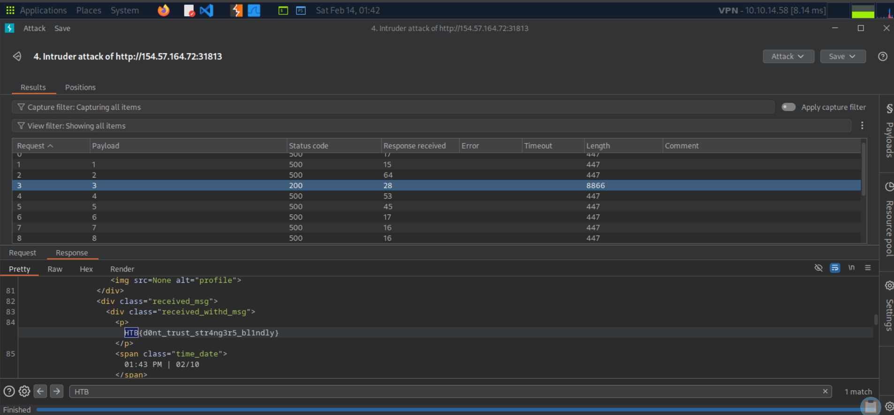

# OnlyHacks – IDOR on Chat Rooms

This write-up documents the discovery and exploitation of an Insecure Direct Object Reference (IDOR) vulnerability in the OnlyHacks dating application.

The objective was to identify fraudulent behavior and retrieve the hidden flag.

---

## Overview

The application allows users to:

- Register profiles
- Match with other users
- Chat inside match-specific conversations

Each conversation is accessed via a numeric parameter:

```
/chat/?rid=<room_id>
```

The vulnerability lies in the fact that the server does **not validate** whether the authenticated user belongs to the requested room.

---

## 1. Creating Valid Matches

To properly interact with the chat feature, two compatible profiles were created:

- User A → Male, interested in Female
- User B → Female, interested in Male

This ensured that a match was generated and a chat conversation (room) was created.

Once matched, accessing:

```
/chat/
```

revealed a valid conversation.

From this point, the room identifier (rid) was observed in the URL:

```
/chat/?rid=11
```

This confirmed:

- Our current room ID = **11**

---

## 2. Identifying the Attack Surface

The room identifier is passed directly as a GET parameter:

```
GET /chat/?rid=11
```

No additional token or ownership verification was observed in the request.

This suggests a potential IDOR vulnerability:

> If the server does not verify ownership of the room, other room IDs may be accessible.

---

## 3. Intruder Enumeration

The request was sent to Burp Intruder.

### Attack configuration:

- Position: `rid` parameter
- Attack type: **Sniper**
- Payload: Numbers from **1 to 15**

Example request template:

```
GET /chat/?rid=§1§ HTTP/1.1
Host: <target>
Cookie: session=<valid_session>
```

---

## 4. Detecting Anomalous Response

Most requests returned:

- Status: 500
- Length: ~447 bytes

However:

- **rid = 3** returned:
  - Status: 200
  - Length: 8702 bytes

The response length difference clearly indicated valid content.



---

## 5. Flag Discovery

Inspecting the response for `rid=3` revealed:

```
HTB{d0nt_trust_str4ng3r5_bl1ndly}
```

This message appeared inside a conversation that did **not belong to our user**.

This confirms:

- The application allows unauthorized access to private chat rooms.
- The vulnerability is a classic **IDOR on room identifiers**.

---

## Root Cause

The backend fails to enforce access control on:

```
/chat/?rid=<id>
```

There is no verification that:

- The authenticated user is part of the requested room

As a result, any authenticated user can enumerate room IDs and access other users' conversations.

---

## Flag

```
HTB{d0nt_trust_str4ng3r5_bl1ndly}
```

---

## Key Takeaways

- Numeric identifiers in URLs are high-risk when not access-controlled.
- Always test horizontal privilege escalation in multi-user applications.
- Response size comparison is a powerful enumeration technique.
- IDOR vulnerabilities are often simple yet critical.

---

## Conclusion

The compromise followed a concise path:

1. Create compatible users to generate a valid room.
2. Identify the `rid` parameter in chat requests.
3. Enumerate room IDs using Burp Intruder.
4. Detect anomalous response size.
5. Retrieve the flag from an unauthorized conversation.

This lab demonstrates how insufficient access control in chat systems can lead to unauthorized data exposure.
