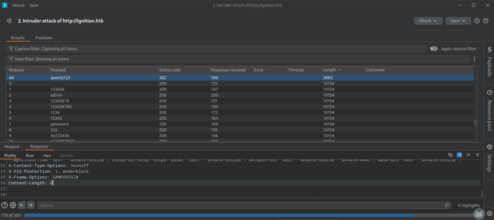
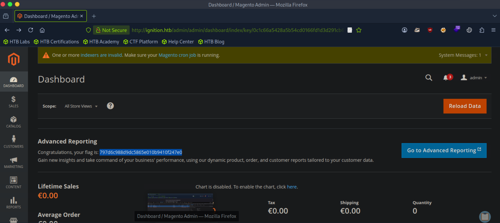

# Ignition

This write-up is provided strictly for educational purposes, to demonstrate how weak credentials and exposed administrative interfaces can be identified and remediated in controlled lab environments.

## Overview

This write-up documents the compromise of the **Ignition** machine. The attack chain is based strictly on observable evidence: reconnaissance, HTTP behavior analysis, virtual host resolution, directory brute-forcing, Magento admin discovery, password brute-force with Burp Intruder (validated by status code and response length), admin access, and flag retrieval.

All steps are reproducible and command-driven.

---

## Answers Summary

- **Service version (port 80)** → `nginx 1.14.2`
- **HTTP status code for /** → `302`
- **Expected virtual host** → `ignition.htb`
- **Hostname resolution file** → `/etc/hosts`
- **Magento login page** → `http://ignition.htb/admin`
- **Admin password** → `qwerty123`
- **Flag** → `797d6c988d9dc5865e010b9410f247e0`

---

## 1. Initial Reconnaissance

A full TCP scan was performed:

```bash
sudo nmap -sCV 10.129.2.26 -p- --min-rate=1000
```

This command performs a complete port scan (`-p-`), runs default scripts (`-sC`), detects service versions (`-sV`), increases scan speed (`--min-rate=1000`).

Results showed the following open port:

- **80/tcp** — HTTP (nginx **1.14.2**)

---

## 2. HTTP Behavior Analysis

Visiting the target by IP:

```bash
curl -I http://10.129.2.26/
```

Returned:

- **HTTP status code: `302`**

A `302` indicates a redirection and often suggests the application expects a specific hostname (virtual host).

---

## 3. Virtual Host Identification

Accessing the website in a browser revealed the virtual host name expected by the application:

```
ignition.htb
```

Since the hostname is not resolvable via public DNS, local name resolution was required.

---

## 4. Hostname Resolution

The target IP and hostname were added to the local hosts file:

```bash
echo "10.129.2.26 ignition.htb" | sudo tee -a /etc/hosts
```

The file holding the local list of domain name to IP address pairs is:

```
/etc/hosts
```

The website is now accessible via:

```
http://ignition.htb/
```

---

## 5. Directory Enumeration

Directory brute-forcing was performed to discover hidden endpoints:

```bash
gobuster dir -u http://ignition.htb \
  -w /usr/share/seclists/Discovery/Web-Content/common.txt \
  -t 10 --timeout 30s
```

- `dir` → directory enumeration mode
- `-u` → target URL
- `-w` → wordlist used
- `-t 10` → number of threads
- `--timeout 30s` → per-request timeout

Results returned a valid admin path:

```
/admin (Status: 200)
```

This confirms the Magento admin login page is located at:

```
http://ignition.htb/admin
```

---

## 6. Identifying the Application

Visiting `/admin` displayed a **Magento Admin** login panel.

The task hint points toward Magento password policy and common passwords. Magento commonly enforces passwords that include both letters and digits, making “common password + digits” patterns likely.

---

## 7. Password Brute-Force (Burp Intruder)

A common-password wordlist (2023) was used: [wordlist](https://github.com/danielmiessler/SecLists/blob/master/Passwords/Common-Credentials/2023-200_most_used_passwords.txt)

The brute-force was performed with **Burp Suite Intruder** (rather than Hydra) to reliably validate success using **response status code** and **response length**.

### 7.1 Intercepting the Login Request

1. Open `http://ignition.htb/admin`.
2. Enter username `admin` and any wrong password.
3. Intercept the request in Burp Proxy.
4. Send the request to Intruder.



### 7.2 Intruder Configuration

- Attack type: **Sniper**
- Payload position: the `password` parameter
- Copy and Paste the Payload list

### 7.3 Validating Success (Evidence)

Intruder results showed a clear anomaly:

- Most attempts returned:
  - **Status: `200`**
  - **Length: `10154`**

- The successful password returned:
  - **Status: `302`**
  - **Length: `3062`**

This difference is proof of authentication success.

The password producing the successful response was:

```
qwerty123
```


---

## 8. Admin Access

Credentials used:

```
Username: admin
Password: qwerty123
```

After login, the Magento dashboard becomes accessible.

---

## 9. Flag Retrieval

On the Magento dashboard, the flag is displayed under **Advanced Reporting**:

```
Congratulations, your flag is: 797d6c988d9dc5865e010b9410f247e0
```

Flag:

```
797d6c988d9dc5865e010b9410f247e0
```



---

## Key Takeaways

- Virtual host requirements can hide applications from direct IP access.
- Directory brute-forcing is effective for discovering exposed admin panels.
- Weak credentials remain a primary compromise path.
- Using response **status code** and **content length** provides strong evidence when brute-forcing.
- Proof-based enumeration avoids guesswork and produces clean, reproducible results.

---

## Conclusion

The compromise followed a clear chain:

1. Full TCP reconnaissance (service discovery).
2. HTTP redirection analysis indicating a virtual host.
3. Hostname resolution via `/etc/hosts`.
4. Directory enumeration to locate the admin panel.
5. Password brute-force using a common-password 2023 list.
6. Authentication confirmed by `302` response and different length.
7. Admin access.
8. Flag retrieval from the dashboard.
